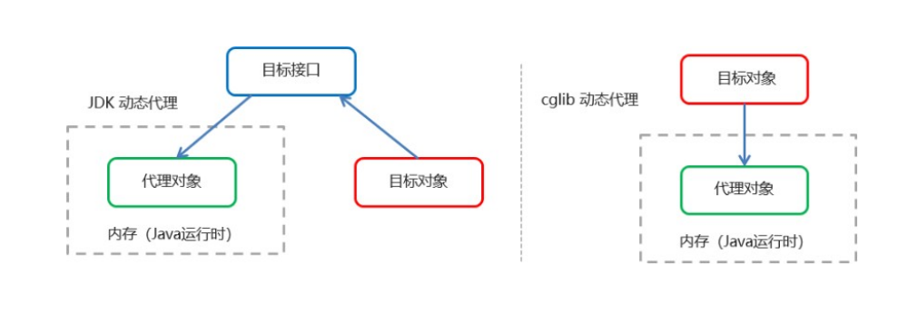
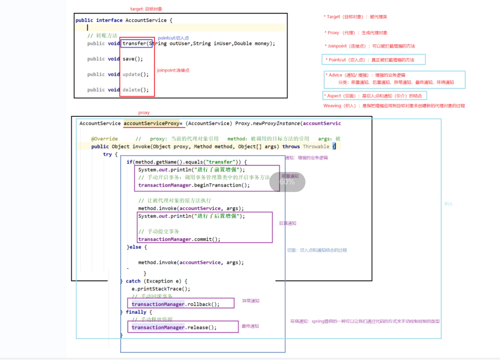
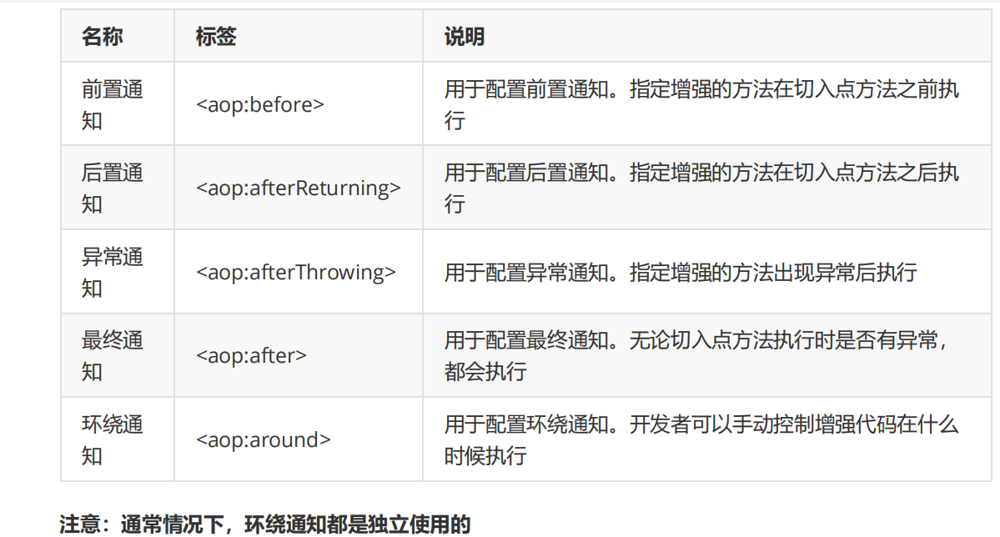
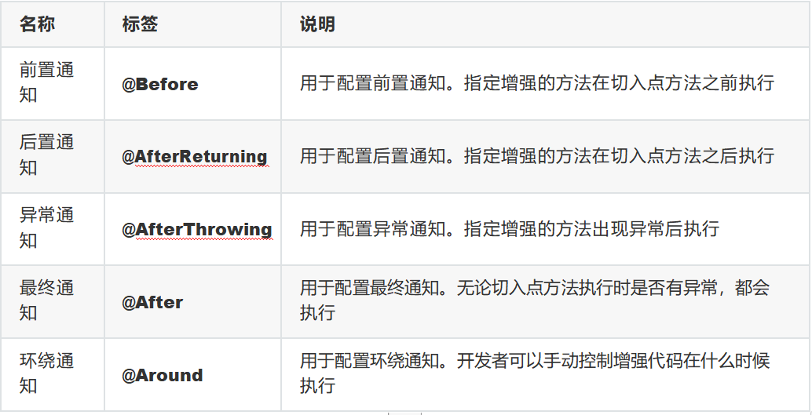

# 任务二：AOP

课程任务主要内容：

```
*转账案例
*Proxy优化转账案例
*初识AOP
*基于XML的AOP开发
*基于注解的AOP开发
*AOP优化转账案例
```


## **一 转账案例**

**需求**

使用spring框架整合DBUtils技术，实现用户转账功能

### **1.1** **基础功能**

#### **步骤分析**

```java
1.创建java项目，导入坐标
2.编写Account实体类
3.编写AccountDao接口和实现类
4.编写AccountService接口和实现类
5.编写spring核心配置文件
6.编写测试代码
```

#### **1**）创建****java****项目，导入坐标

```java
<dependencies>
<dependency>
    /*数据库的驱动*/
<groupId>mysql</groupId>
<artifactId>mysql-connector-java</artifactId>
<version>5.1.47</version>
</dependency>
    /*数据库连接池*/
<dependency>
<groupId>com.alibaba</groupId>
<artifactId>druid</artifactId>
<version>1.1.15</version>
</dependency>
    /*DButils的依赖*/
<dependency>
<groupId>commons-dbutils</groupId>
<artifactId>commons-dbutils</artifactId>
<version>1.6</version>
</dependency>
    /*Spring的相关依赖*/
<dependency>
<groupId>org.springframework</groupId>
<artifactId>spring-context</artifactId>
<version>5.1.5.RELEASE</version>
</dependency>
<dependency>
<groupId>org.springframework</groupId>
<artifactId>spring-test</artifactId>
<version>5.1.5.RELEASE</version>
</dependency>
<dependency>
<groupId>junit</groupId>
<artifactId>junit</artifactId>
<version>4.12</version>
</dependency>
</dependencies>
```

####  2）编写****Account****实体类

```java
public class Account {
    private Integer id;
    private String name;
    private Double money;

    public Integer getId() {
        return id;
    }

    public String getName() {
        return name;
    }

    public Double getMoney() {
        return money;
    }

    @Override
    public String toString() {
        return "Account{" +
                "id=" + id +
                ", name='" + name + '\'' +
                ", money=" + money +
                '}';
    }
}
```

#### 3）编写****AccountDao****接口和实现类

接口：

```java
public interface AccountDao {
    
    //转出
    public void out(String outUser,Double money);
    
    //转入
    public void in(String inUser,Double money);
}
```

实现类：

```java
@Repository("accountDao") //生成该类的实例存在IOC容器中
public class AccountDaoImpl implements AccountDao {

    @Autowired
    private QueryRunner queryRunner;

    /**
     * 转出操作
     * @param outUser
     * @param money
     */
    public void out(String outUser, Double money) {

        String sql = "update account set money = money - ? where name = ?";

        try {
            queryRunner.update(sql,money,outUser);
        } catch (SQLException e) {
            e.printStackTrace();
        }


    }


    /**
     * 转入操作
     * @param inUser
     * @param money
     */
    public void in(String inUser, Double money) {
        
        String sql = "update account set money = money + ? where name = ?";
        try {
            queryRunner.update(sql,money,inUser);
        } catch (SQLException e) {
            e.printStackTrace();
        }

    }
}
```

#### 4****）编写****AccountService****接口和实现类

接口：

```
 //转账方法
    public void transfer(String outUser,String inUser, double money);
```

实现类：

```
@Service("accountService")
public class AccountServiceImpl implements AccountService {
    @Autowired
    private AccountDao accountDao;

    /**
     * 转账方法
     * @param outUser
     * @param inUser
     * @param money
     */
    public void transfer(String outUser, String inUser, double money) {

        /**
         * 调用了减钱方法
         */
        accountDao.out(outUser,money);

        /**
         * 加钱方法
         */
        accountDao.in(inUser,money);

    }
}
```


#### **5**）编写spring核心配置文件


```
<?xml version="1.0" encoding="UTF-8"?>
<beans xmlns="http://www.springframework.org/schema/beans"
       xmlns:xsi="http://www.w3.org/2001/XMLSchema-instance"
       xmlns:context="http://www.springframework.org/schema/context"
       xsi:schemaLocation="
http://www.springframework.org/schema/beans
http://www.springframework.org/schema/beans/spring-beans.xsd
 http://www.springframework.org/schema/context
 http://www.springframework.org/schema/context/spring-context.xsd">


    <!--引入properties文件-->
   <context:property-placeholder location="classpath:jdbc.properties"></context:property-placeholder>

    <!--开启注解扫描-->
    <context:component-scan base-package="com.cuiwei"></context:component-scan>

    <!--配置DataSource-->
    <bean id="dataSource" class="com.alibaba.druid.pool.DruidDataSource">
        <property name="driverClassName" value="${jdbc.driverClassName}"></property>
        <property name="url" value="${jdbc.url}"></property>
        <property name="username" value="${jdbc.username}"></property>
        <property name="password" value="${jdbc.password}"></property>

    </bean>


    <!--配置QueryRunner-->
    <bean id="queryRunner" class="org.apache.commons.dbutils.QueryRunner">
        <constructor-arg ref="dataSource" name="ds"></constructor-arg>
    </bean>
</beans>
```

#### （6）编写测试代码：

```
@RunWith(SpringJUnit4ClassRunner.class)
@ContextConfiguration({"classpath:applicationContext.xml"})
public class AccountServiceTest {

    @Autowired
    private AccountService accountService;

    @Test
    public void testTransfer(){

        accountService.transfer("tom","jerry",100d);

    }
}
```


#### **7**）问题分析

上面的代码事务在dao层，转出转入操作都是一个独立的事务，但实际开发，应该把业务逻辑控制在

一个事务中，所以应该将事务挪到service层。也就是像上边的案例，如果程序在转出钱后，程序有异常，

这样钱传出去了，但是对方没有收到钱。

### **2.2** **传统事务**

#### **步骤分析**

```markdown
1.编写线程绑定工具类   //就是把连接对象与线程就行绑定，从而保证Dao层用到的Connection是同一个
2.编写事务管理器   //开启事务，提交事务 ，回滚事务，关闭事务
3.修改service层代码
4.修改dao层代码
```

#### **1**）编写线程绑定工具类

```java
/**
 * 连接工具类，从数据源中获取一个连接，并且将获取到的连接与线程进行绑定
 * ThreadLocal: 线程内部的存储类，可以在指定的线程内存储数据  key: ThreadLocal    value: 任意类型的值，在这存的就是Connection
 */
@Component
public class ConnectionUtils {

    @Autowired
    private DataSource dataSource;
    
    private ThreadLocal<Connection> threadLocal = new ThreadLocal<Connection>();

    /**
     * 获取当前线程上绑定的连接，如果获取到的连接为空，那么就要从数据源中获取连接，并且方到ThreadLocal中（绑定到当前线程）
     * 
     * @return
     */
    public Connection getThreadConnection(){

        //先从ThreadLocal获取连接
        Connection connection = threadLocal.get();
        
        //判断线程中是否有Connection
        if(connection == null){
            //3.从数据源中获取一个连接，存到ThreadLocal中

            try {
                //不为Nnull
                Connection connection1 = dataSource.getConnection();
                
                threadLocal.set(connection);
            } catch (SQLException e) {
                e.printStackTrace();
            }
        }
        return connection;
        
    }


    /**
     * 解除线程的连接绑定
     */
    
    public void removeThreadConnection(){
        
        threadLocal.remove();
    }

}
```

连接工具类，从数据源中获取一个连接，并且将获取到的连接与线程进行绑定

 * ThreadLocal: 线程内部的存储类，可以在指定的线程内存储数据  key: ThreadLocal    value: 任意类型的值，在这存的就是Connection

* 连接工具类，从数据源中获取一个连接，并将实现和线程的绑定 


#### **2**）编写事务管理器

```
**
 * 事务管理器工具类    开启事务，提交事务，回滚事务，释放资源
 */
@Component
public class TransactionManager {

    @Autowired
    private  ConnectionUtils connectionUtils;
    /**
     * 开启事务
     */


    public void beginTransaction(){
        //获取一个Connection对象
        Connection connection = connectionUtils.getThreadConnection();
        try {
            //开启了一个手动事务，关闭了自动提交
            connection.setAutoCommit(false);
        } catch (SQLException e) {
            e.printStackTrace();
        }

    }

    /**
     * 提交事务
     */

    public void commit(){
        Connection connection = connectionUtils.getThreadConnection();
        try {
            connection.commit();
        } catch (SQLException e) {
            e.printStackTrace();
        }
    }

    /**
     * 回滚事务
     */

    public void rollback(){
        Connection connection = connectionUtils.getThreadConnection();
        try {
            connection.rollback();
        } catch (SQLException e) {
            e.printStackTrace();
        }
    }

    /**
     * 释放资源
     */
    public void release(){

        //将手动事务，改回为自动提交事务
        Connection connection = connectionUtils.getThreadConnection();
        try {
            connection.setAutoCommit(true);
        } catch (SQLException e) {
            e.printStackTrace();
        }


        try {
            //将连接归还到连接池
            connectionUtils.getThreadConnection().close();
            //解除线程绑定
            connectionUtils.removeThreadConnection();

        } catch (SQLException e) {
            e.printStackTrace();
        }

    }
}
```

####  **3**）修改****service****层代码


```
@Service("accountService")
public class AccountServiceImpl implements AccountService {
    @Autowired
    private AccountDao accountDao;
    @Autowired
    private TransactionManager transactionManager;

    /**
     * 转账方法
     * @param outUser
     * @param inUser
     * @param money
     */
    public void transfer(String outUser, String inUser, double money) {


        //手动开启事务，调用事务管理器类中的开启事务中的方法

        transactionManager.beginTransaction();

        try {
            /**
             * 调用了减钱方法
             */
            accountDao.out(outUser,money);
            
            int i = 1/0;

            /**
             * 加钱方法
             */
            accountDao.in(inUser,money);


            //手动提交事务
            transactionManager.commit();
        } catch (Exception e) {
            e.printStackTrace();
            //手动回滚事务
            transactionManager.rollback();
        }
        finally {
            //手动释放资源
            transactionManager.release();
        }
        

    }
}
```

#### **4**）修改****dao****层代码

```
@Repository("accountDao") //生成该类的实例存在IOC容器中
public class AccountDaoImpl implements AccountDao {

    @Autowired
    private QueryRunner queryRunner;

    @Autowired
    private ConnectionUtils connectionUtils;

    /**
     * 转出操作
     * @param outUser
     * @param money
     */
    public void out(String outUser, Double money) {

        String sql = "update account set money = money - ? where name = ?";

        try {
            queryRunner.update(connectionUtils.getThreadConnection(),sql,money,outUser);
        } catch (SQLException e) {
            e.printStackTrace();
        }


    }
    /**
     * 转入操作
     * @param inUser
     * @param money
     */
    public void in(String inUser, Double money) {

        String sql = "update account set money = money + ? where name = ?";
        try {
            queryRunner.update(connectionUtils.getThreadConnection(),sql,money,inUser);
        } catch (SQLException e) {
            e.printStackTrace();
        }

    }
}
```

#### **5）问题分析**

```
上面代码，通过对业务层改造，已经可以实现事务控制了，但是由于我们添加了事务控制，也产生了

一个新的问题： 业务层方法变得臃肿了，里面充斥着很多重复代码。并且业务层方法和事务控制方法耦

合了，违背了面向对象的开发思想。
```

## **二** **Proxy**优化转账案例

我们可以将业务代码和事务代码进行拆分，通过动态代理的方式，对业务方法进行事务的增强。这样

就不会对业务层产生影响，解决了耦合性的问题啦！

#### **常用的动态代理技术**

<1>JDK 代理 : 基于接口的动态代理技术·：利用拦截器（必须实现invocationHandler）加上反射机制生成

一个代理接口的匿名类，在调用具体方法前调用InvokeHandler来处理，从而实现方法增强。

<2>CGLIB代理：基于父类的动态代理技术：动态生成一个要代理的子类，子类重写要代理的类的所有不是

final的方法。在子类中采用方法拦截技术拦截所有的父类方法的调用，顺势织入横切逻辑，对方法进行

增强。



#### **2.1 JDK**动态代理方式

JDK工厂类：

```
/**
 * JDK动态代理工厂类
 *
 *
 */
@Component
public class JDKProxyFactory {

    @Autowired
    private AccountService accountService;

    @Autowired
    private TransactionManager transactionManager;

    /**
     * 采用JDK动态代理技术来生成目标类的代理对象
     *
     * ClassLoader loader:类加载器，帮助被代理对象获取到类加载器
     * Class  <?> interface被代理类所实现的全部接口
     * InvocationHandler h:当代理对象调用接口的任意方法时，那么都会去执行InvocationHandler中的invoke方法
     */

    public AccountService createAccountServiceJDKProxy(){

        AccountService accountServiceProxy = (AccountService) Proxy.newProxyInstance(accountService.getClass().getClassLoader(), accountService.getClass().getInterfaces(), new InvocationHandler() {

            //proxy当前代理对象的引用
            //method:被调用的目标方法的引用
            //args被调用目标方法的参数
            public Object invoke(Object proxy, Method method, Object[] args) throws Throwable {

                //被代理对象的原方法执行


                try {
                    //手动开启事务，调用事务管理器类中的开启事务中的方法

                    transactionManager.beginTransaction();
                    method.invoke(accountService, args);
                    //手动的开启事务
                    transactionManager.commit();
                } catch (Exception e) {
                    e.printStackTrace();
                    //手动回滚事务
                    transactionManager.rollback();
                }finally {
                    //手动释放资源
                    transactionManager.release();
                }
                return null;
            }
        });

        return accountServiceProxy;

    }
}
```

类加载器的概念：类加载器本身也是一个类，其实质是把类文件从硬盘读取到内存中！

类加载的作用：类加载器它是在虚拟机中完成的，负责动态加载Java类到Java虚拟机的内存空间中，在经过 Java 编译器编译之后就被转换成 Java 字节代码（.class 文件）。类加载器负责读取 Java 字节代码，并转换成 `java.lang.Class`类的一个实例。


accountServiceImpl类：

```
 /**
         * 调用了减钱方法
         */
        accountDao.out(outUser, money);


        /**
         * 加钱方法
         */
        accountDao.in(inUser, money);


    }
```


测试类：

```
 @Test
    public void testTransferProxy(){
        //当前返回的时AccountService的代理对象proxy
        AccountService accountServiceJDKProxy = jdkProxyFactory.createAccountServiceJDKProxy();
        //代理对象调用该接口的任意方法时都会执行底层的invoke方法
        accountServiceJDKProxy.transfer("tom","jerry",100d);


    }
```


#### **2.2 CGLIB**动态代理方式

Cglib工厂类:

```java
/**
 * 该类类型就是采用CGlIB动态代理对目标类（AccountServiceImpl）进行方法transfer的动态增强（添加事务控制)
 */
public class CGlibProxyFactory {

    @Autowired
    private AccountService accountService;

    @Autowired
    private TransactionManager transactionManager;

    public AccountService creatAccountServiceCglibFactory() {
        //重写Cglib对应的API生成代理对象并进行返回
        //增强字节码
        //参数1：目标类的字节码对象
        //参数2：动作类，当代理对象调用目标对象的原方法时，那么会执行intercept方法
        final AccountService accountServiceProxy = (AccountService) Enhancer.create(accountService.getClass(), new MethodInterceptor() {
            // o:生成的代理对象
            //method:调用目标方法的引用
            //objects:方法入参
            //methodProxy: 代理方法
            public Object intercept(Object o, Method method, Object[] objects, MethodProxy methodProxy) throws Throwable {

                try {
                  transactionManager.beginTransaction();
                    method.invoke(accountService, objects);
                    transactionManager.commit();
                } catch (Exception e) {
                    e.printStackTrace();
                    transactionManager.rollback();
                } finally {
                    transactionManager.release();
                }
                return null;
            }

        });
        return accountServiceProxy;


        }


}
```

accountService类：

```java
 public void transfer(String outUser, String inUser, double money) {


        /**
         * 调用了减钱方法
         */
        accountDao.out(outUser, money);

        /**
         * 加钱方法
         */
        accountDao.in(inUser, money);


    }
}
```


测试类：

```
/**
 * 使用CGlib动态代理优化转账案例
 */
@Test
public void testTransferProxyCGlib(){
    AccountService accountService = cGlibProxyFactory.creatAccountServiceCglibFactory();
    accountService.transfer("tom","jerry",100d);


}
```


## 三 初识AOP


#### **3.1** **什么是**AOP


```
AOP 为 Aspect Oriented Programming 的缩写，意思为面向切面编程
AOP 是 OOP（面向对象编程） 的延续，是软件开发中的一个热点，也是Spring框架中的一个重要内
容，利用AOP可以对业务逻辑的各个部分进行隔离，从而使得业务逻辑各部分之间的耦合度降低，提高
程序的可重用性，同时提高了开发的效率。
这样做的好处是：
1. 在程序运行期间，在不修改源码的情况下对方法进行功能增强
2. 逻辑清晰，开发核心业务的时候，不必关注增强业务的代码
3. 减少重复代码，提高开发效率，便于后期维护.
```


#### **3.2 AOP**底层实现

实际上，AOP 的底层是通过 Spring 提供的的**动态代理技术**实现的。在运行期间，Spring通过动态代

理技术动态的生成代理对象，代理对象方法执行时进行增强功能的介入，在去调用目标对象的方法，从

而完成功能的增强。

#### *3.3 AOP*相关术语

Spring 的 AOP 实现底层就是对上面的动态代理的代码进行了封装，封装后我们只需要对需要关注的

部分进行代码编写，并通过配置的方式完成指定目标的方法增强。

在正式讲解 AOP 的操作之前，我们必须理解 AOP 的相关术语，常用的术语如下：

```
* Target（目标对象）：代理的目标对象 
* Proxy （代理）：一个类被 AOP 织入增强后，就产生一个结果代理类 
* Joinpoint（连接点）：所谓连接点是指那些可以被拦截到的点。在spring中,这些点指的是方法，因为 spring只支持方法类型的连接点
* Pointcut（切入点）：所谓切入点是指我们要对哪些 Joinpoint 进行拦截的定义 
* Advice（通知/ 增强）：所谓通知是指拦截到 Joinpoint 之后所要做的事情就是通知 分类：前置通知、后置通知、异常通知、最终通知、环绕通知 
* Aspect（切面）：是切入点和通知（引介）的结合
* Weaving（织入）：是指把增强应用到目标对象来创建新的代理对象的过程。spring采用动态代理织 入，而AspectJ采用编译期织入和类装载期织入
```



#### **3.4 AOP**开发明确事项

##### **3.4.1** **开发阶段（我们做的）**

1. ```
   1. 编写核心业务代码（目标类的目标方法） 切入点
   
   2. 把公用代码抽取出来，制作成通知（增强功能方法） 通知
   
   3. 在配置文件中，声明切入点与通知间的关系，即切面
   ```

   

##### **3.4.2** **运行阶段（**Spring****框架完成的）

```
Spring 框架监控切入点方法的执行。一旦监控到切入点方法被运行，使用代理机制，动态创建目标对

象的代理对象，根据通知类别，在代理对象的对应位置，将通知对应的功能织入，完成完整的代码逻辑

运行。
```


##### **3.4.3** **底层代理实现**

```
在 Spring 中，框架会根据目标类是否实现了接口来决定采用哪种动态代理的方式。

当bean实现接口时，会用JDK代理模式

当bean没有实现接口，用cglib实现（ 

可以强制使用cglib（在spring配置中加入<aop:aspectjautoproxy proxyt-target-class=”true”/>）
```


#### **3.5** **知识小结**


```
* aop：面向切面编程 
* aop底层实现：基于JDK的动态代理 和 基于Cglib的动态代理 
* aop的重点概念： Pointcut（切入点）：真正被增强的方法 Advice（通知/ 增强）：封装增强业务逻辑的方法 Aspect（切面）：切点+通知 Weaving（织入）：将切点与通知结合，产生代理对象的过程
```

## **四 基于**XML****的****AOP****开发

### **4.1** **快速入门**

#### **步骤分析**

```
1. 创建java项目，导入AOP相关坐标 
2. 创建目标接口和目标实现类（定义切入点）
3. 创建通知类及方法（定义通知）
4. 将目标类和通知类对象创建权交给spring 
5. 在核心配置文件中配置织入关系，及切面
6. 编写测试代码
```


#### **4.1.1** **创建**java****项目，导入****AOP****相关坐标

```xml
<dependencies>


    <!--导入spring的context坐标，context依赖aop-->
    <dependency>
    <groupId>org.springframework</groupId>
    <artifactId>spring-context</artifactId>
    <version>5.1.5.RELEASE</version>
</dependency>

    <!-- aspectj的织入（切点表达式需要用到该jar包） -->
    <dependency>
    <groupId>org.aspectj</groupId>
    <artifactId>aspectjweaver</artifactId>
    <version>1.8.13</version>
</dependency>

    <!--spring整合junit-->
    <dependency>
    <groupId>org.springframework</groupId>
    <artifactId>spring-test</artifactId>
    <version>5.1.5.RELEASE</version>
</dependency>


    <dependency>
    <groupId>junit</groupId>
    <artifactId>junit</artifactId>
    <version>4.12</version>
</dependency>

</dependencies>
```


#### **4.1.2** **创建目标接口和目标实现类**

接口：

```java
public interface AccountService {
    /**
     * 切入点，要进行拦截增强的方法（目标方法
     */
    public void transfer();
}
```

实现类：

```java
public class AccountServiceImpl implements AccountService {
    public void transfer() {
        System.out.println("转账方法执行了");
    }
}
```

#### **4.1.3** **创建通知类**

```java
/**
 * 通知类
 */
public class MyAdvice {

    public void before(){
        System.out.println("前置通知执行了");
    }
}
```

#### **4.1.4** **将目标类和通知类对象创建权交给**spring

```
<?xml version="1.0" encoding="UTF-8"?>
<beans xmlns="http://www.springframework.org/schema/beans"
       xmlns:xsi="http://www.w3.org/2001/XMLSchema-instance"
       xmlns:aop="http://www.springframework.org/schema/aop"
       xsi:schemaLocation="http://www.springframework.org/schema/beans
       http://www.springframework.org/schema/beans/spring-beans.xsd
       http://www.springframework.org/schema/aop
       http://www.springframework.org/schema/aop/spring-aop.xsd">

    
    <!--把目标类交给IOC容器-->
    <bean id="accountService" class="com.cuiwei.service.impl.AccountServiceImpl"></bean>
    <!--通知类也交给IOC容器-->
    <bean id="myAdvice" class="com.cuiwei.advice.MyAdvice"></bean>
</beans>
```

#### **4.1.5** **在核心配置文件中配置织入关系，及切面**

```
<!--AOP配置-->
<aop:config>
    <!--配置切面    切入点和通知的结合-->
    <aop:aspect ref="myAdvice">
        <aop:before method="before" pointcut="execution(public void com.cuiwei.service.impl.AccountServiceImpl.transfer())"></aop:before>
    </aop:aspect>
</aop:config>
```

**<aop before>方法配置目标类的transfer方法执行时，使用myAdvice类中的before方法做一个前置增强。brfore()方法优先于transfer方法。**

#### **4.1.6** **编写测试代码**

```
@RunWith(SpringJUnit4ClassRunner.class)
@ContextConfiguration({"classpath:applicationContext.xml"})
public class AccountServiceTest {

    @Autowired
    private AccountService accountService;

    @Test
    public void testTransfer(){
        accountService.transfer();
    }

}
```

### **4.2 XML**配置****AOP****详解

##### **4.2.1** **切点表达式**

表达式语法：

```
execution([修饰符] 返回值类型 包名.类名.方法名(参数))访问修饰符可以省略
```

```
访问修饰符可以省略
execution( void com.cuiwei.service.impl.AccountServiceImpl.transfer())
返回值类型、包名、类名、方法名可以使用星号 * 代替，代表任意
execution( * *.*.*.*.*.*())
包名与类名之间一个点 . 代表当前包下的类，两个点 .. 表示当前包及其子包下的类
execution( * *..*.*())
参数列表可以使用两个点 .. 表示任意个数，任意类型的参数列表
execution( * *..*.*(..))
```

例如：

```
execution(public void com.lagou.service.impl.AccountServiceImpl.transfer()) 

execution(void com.lagou.service.impl.AccountServiceImpl.*(..)) 

execution(* com.lagou.service.impl.*.*(..)) 

execution(* com.lagou.service..*.*(..)) 
```

切点表达式抽取：

当多个增强的切点表达式相同时，可以将切点表达式进行抽取，在增强中使用 pointcut-ref 属性代替

pointcut 属性来引用抽取后的切点表达式。

```
<!--AOP配置-->
    <aop:config>
        <!--抽取表达式-->
        <aop:pointcut id="myPointcut" expression="execution(* com.cuiwei.service.impl.AccountServiceImpl.*(..))"/>
        <!--配置切面    切入点和通知的结合-->
        <aop:aspect ref="myAdvice">
            <aop:before method="before" pointcut-ref="myPointcut"></aop:before>
            <aop:after method="afterReturning" pointcut-ref="myPointcut"></aop:after>
        </aop:aspect>
    </aop:config>
```


##### **4.2.2** **通知类型**

通知的配置语法：、

```
<aop:通知类型 method=“通知类中方法名” pointcut=“切点表达式"></aop:通知类型>
```



后置通知和异常通知只有一个可以执行。


环绕通知的配置：

```
 <!--AOP配置-->
    <aop:config>
        <!--抽取表达式-->
        <aop:pointcut id="myPointcut" expression="execution(* com.cuiwei.service.impl.AccountServiceImpl.*(..))"/>
        <!--配置切面    切入点和通知的结合-->
          <aop:around method="around" pointcut-ref="myPointcut"></aop:around>
        </aop:aspect>
    </aop:config>
```

环绕通知可以让我们手动的通过代码来增强事务逻辑的方式。

```
//Proceeding JoinPoint:正在执行的一个连接点 切点
   public Object around(ProceedingJoinPoint pjp){

       System.out.println("前置通知执行了");
       //切点方法执行
       try {
           System.out.println("前置通知执行了");
           Object proceed = pjp.proceed();
           System.out.println("后置通知执行了");
       } catch (Throwable throwable) {
           throwable.printStackTrace();
           System.out.println("异常通知执行了");
       }
       finally {
           System.out.println("最终通知执行了");
       }
       return null;
   }
```

### **4.3** **知识小结**

```
* aop织入的配置
<aop:config> 
<aop:aspect ref=“通知类”> 
<aop:before method=“通知方法名称” pointcut=“切点表达式"></aop:before>
</aop:aspect> 
</aop:config> 

* 通知的类型 前置通知、后置通知、异常通知、最终通知 环绕通知 

* 切点表达式 execution([修饰符] 返回值类型 包名.类名.方法名(参数))
```


## **五 基于注解的**AOP****开发

### **5.1** **快速入门**

#### **步骤分析**

```
1. 创建java项目，导入AOP相关坐标 

2. 创建目标接口和目标实现类（定义切入点） 

3. 创建通知类（定义通知） 

4. 将目标类和通知类对象创建权交给spring 

5. 在通知类中使用注解配置织入关系，升级为切面类 

6. 在配置文件中开启组件扫描和 AOP 的自动代理 

7. 编写测试代码 
```


#### **5.1.1** **创建**java****项目，导入****AOP****相关坐标

```
<?xml version="1.0" encoding="UTF-8"?>
<project xmlns="http://maven.apache.org/POM/4.0.0"
         xmlns:xsi="http://www.w3.org/2001/XMLSchema-instance"
         xsi:schemaLocation="http://maven.apache.org/POM/4.0.0 http://maven.apache.org/xsd/maven-4.0.0.xsd">
    <modelVersion>4.0.0</modelVersion>

    <groupId>com.cuiwei</groupId>
    <artifactId>spring_aop_xml</artifactId>
    <version>1.0-SNAPSHOT</version>

    <dependencies>


        <!--导入spring的context坐标，context依赖aop-->
        <dependency>
        <groupId>org.springframework</groupId>
        <artifactId>spring-context</artifactId>
        <version>5.1.5.RELEASE</version>
    </dependency>

        <!-- aspectj的织入（切点表达式需要用到该jar包） -->
        <dependency>
        <groupId>org.aspectj</groupId>
        <artifactId>aspectjweaver</artifactId>
        <version>1.8.13</version>
    </dependency>

        <!--spring整合junit-->
        <dependency>
        <groupId>org.springframework</groupId>
        <artifactId>spring-test</artifactId>
        <version>5.1.5.RELEASE</version>
    </dependency>


        <dependency>
        <groupId>junit</groupId>
        <artifactId>junit</artifactId>
        <version>4.12</version>
    </dependency>

    </dependencies>
</project>
```

#### **5.1.2** **创建目标接口和目标实现类**

接口：

```
public interface AccountService {
    public void transfer();
}
```

实现类：

```
@Service
public class AccountServiceImpl implements AccountService {
    @Override
    public void transfer() {
        System.out.println("转账方法执行了");
    }
}
```

#### **5.1.3** **创建通知类**   **将目标类和通知类对象创建权交给**spring   **在通知类中使用注解配置织入关系，升级为切面类**

```
/**
 *  * 通知类
 */
@Component
@Aspect //升级为切面类，配置切入点和通知的关系
public class MyAdvice {

    @Before("execution(* com.cuiwei.Service.impl.AccountServiceImpl.*(..))")
    public void before(){
        System.out.println("前置方法执行了....");
    }
}
```


#### **5.1.4 **在配置文件中开启组件扫描和 **AOP** **的自动代理**

```
<!--开启IOC注解扫面-->
<context:component-scan base-package="com.cuiwei"></context:component-scan>

<!--开启AOP的自动代理   spring会采用动态代理完成织入增强，并且生成代理  强制使用CGLIB动态代理-->
<aop:aspectj-autoproxy proxy-target-class="true"></aop:aspectj-autoproxy>
```

注意：如果要强制将其代理模式改为CGLIB模式，那么要添加proxy-target-class，使其为true


### **5.2** **注解配置**AOP****详解

#### **5.2.1** **切点表达式**

切点表达式的抽取

```
@Pointcut("execution(* com.cuiwei.Service.impl.AccountServiceImpl.*(..))")
public void myPonit(){

}

@Before("MyAdvice.myPonit()")
public void before(){
    System.out.println("前置方法执行了....");
}
```


#### **5.2.2** **通知类型**

通知的配置语法：@通知注解(“切点表达式")



**注意：**

当前四个通知组合在一起时，执行顺序如下：

@Before -> @After -> @AfterReturning（如果有异常：@AfterThrowing）

#### **5.2.3** **纯注解配置**

```
@Configuration
@ComponentScan("com.cuiwei")
@EnableAspectJAutoProxy   //开启AOP的自动代理  替代了 <aop:aspectj-autoproxy />
public class springConfig {
}
```

### **5.3** **知识小结**

```
*使用@Aspect注解，标注切面类

*使用@Before等注解，标注通知方法

*使用@Pointcut注解，抽取切点表达式

*配置aop自动代理 <aop:aspectj-autoproxy/> 或 @EnableAspectJAutoProxy
```

## **六** **AOP**优化转账案例

依然使用前面的转账案例，将两个代理工厂对象直接删除！改为spring的aop思想来实现

**6.1 xml**配置实现

**1****）配置文件**

\* 使用@Aspect注解，标注切面类 

\* 使用@Before等注解，标注通知方法 

\* 使用@Pointcut注解，抽取切点表达式 

\* 配置aop自动代理 <aop:aspectj-autoproxy/> 或 @EnableAspectJAutoProxy 

<?xml version="1.0" encoding="UTF-8"?> 

<beans xmlns="http://www.springframework.org/schema/beans" 

xmlns:xsi="http://www.w3.org/2001/XMLSchema-instance" 

xmlns:aop="http://www.springframework.org/schema/aop" 

xmlns:context="http://www.springframework.org/schema/context" 

xsi:schemaLocation=" 

http://www.springframework.org/schema/beans 

http://www.springframework.org/schema/beans/spring-beans.xsd 

http://www.springframework.org/schema/aop 

http://www.springframework.org/schema/aop/spring-aop.xsd 

http://www.springframework.org/schema/context 

http://www.springframework.org/schema/context/spring-context.xsd"> 

<!--开启组件扫描--> 

<context:component-scan base-package="com.lagou"/> 

<!--加载jdbc配置文件--> 

<context:property-placeholder location="classpath:jdbc.properties"/> 

<!--把数据库连接池交给IOC容器--> 

<bean id="dataSource" class="com.alibaba.druid.pool.DruidDataSource"> 

<property name="driverClassName" value="${jdbc.driver}"></property> 

<property name="url" value="${jdbc.url}"></property> 

<property name="username" value="${jdbc.username}"></property> 

<property name="password" value="${jdbc.password}"></property> 

</bean> 

<!--把QueryRunner交给IOC容器--> 

<bean id="queryRunner" class="org.apache.commons.dbutils.QueryRunner"> 

<constructor-arg name="ds" ref="dataSource"></constructor-arg> 

</bean> 

<!--AOP配置--> 

<aop:config> 

<!--切点表达式-->**2****）事务管理器（通知）**

<aop:pointcut id="myPointcut" expression="execution(* 

com.lagou.service..*.*(..))"/> 

<!-- 切面配置 --> 

<aop:aspect ref="transactionManager"> 

<aop:before method="beginTransaction" pointcut-ref="myPointcut"/> 

<aop:after-returning method="commit" pointcut-ref="myPointcut"/> 

<aop:after-throwing method="rollback" pointcut-ref="myPointcut"/> 

<aop:after method="release" pointcut-ref="myPointcut"/> 

</aop:aspect> 

</aop:config> 

</beans> 

// 事务管理器工具类，包括：开启事务、提交事务、回滚事务、释放资源 

@Component 

public class TransactionManager { 

@Autowired 

ConnectionUtils connectionUtils; 

public void begin(){ 

try {

connectionUtils.getThreadConnection().setAutoCommit(false); 

} catch (SQLException e) { 

e.printStackTrace(); 

} 

}

public void commit(){ 

try {

connectionUtils.getThreadConnection().commit(); 

} catch (SQLException e) { 

e.printStackTrace(); 

} 

}

public void rollback(){ 

try {

connectionUtils.getThreadConnection().rollback(); 

} catch (SQLException e) { 

e.printStackTrace(); 

} 

}

public void release(){ 

try {

connectionUtils.getThreadConnection().setAutoCommit(true); 

connectionUtils.getThreadConnection().close(); 

connectionUtils.removeThreadConnection(); 

} catch (SQLException e) {**6.2** **注解配置实现**

**1****）配置文件**

**2****）事务管理器（通知）**

e.printStackTrace(); 

} 

} 

}

<?xml version="1.0" encoding="UTF-8"?> 

<beans xmlns="http://www.springframework.org/schema/beans" 

xmlns:xsi="http://www.w3.org/2001/XMLSchema-instance" 

xmlns:aop="http://www.springframework.org/schema/aop" 

xmlns:context="http://www.springframework.org/schema/context" 

xsi:schemaLocation=" 

http://www.springframework.org/schema/beans 

http://www.springframework.org/schema/beans/spring-beans.xsd 

http://www.springframework.org/schema/aop 

http://www.springframework.org/schema/aop/spring-aop.xsd 

http://www.springframework.org/schema/context 

http://www.springframework.org/schema/context/spring-context.xsd"> 

<!--开启组件扫描--> 

<context:component-scan base-package="com.lagou"/> 

<!--开启AOP注解支持--> 

<aop:aspectj-autoproxy/> 

<!--加载jdbc配置文件--> 

<context:property-placeholder location="classpath:jdbc.properties"/> 

<!--把数据库连接池交给IOC容器--> 

<bean id="dataSource" class="com.alibaba.druid.pool.DruidDataSource"> 

<property name="driverClassName" value="${jdbc.driver}"></property> 

<property name="url" value="${jdbc.url}"></property> 

<property name="username" value="${jdbc.username}"></property> 

<property name="password" value="${jdbc.password}"></property> 

</bean> 

<!--把QueryRunner交给IOC容器--> 

<bean id="queryRunner" class="org.apache.commons.dbutils.QueryRunner"> 

<constructor-arg name="ds" ref="dataSource"></constructor-arg> 

</bean> 

</beans> 

@Component 

@Aspectpublic class TransactionManager { 

@Autowired 

ConnectionUtils connectionUtils; 

@Around("execution(* com.lagou.serivce..*.*(..))") 

public Object around(ProceedingJoinPoint pjp) { 

Object object = null; 

try {

// 开启事务 

connectionUtils.getThreadConnection().setAutoCommit(false); 

// 业务逻辑 

pjp.proceed(); 

// 提交事务 

connectionUtils.getThreadConnection().commit(); 

} catch (Throwable throwable) { 

throwable.printStackTrace(); 

// 回滚事务 

try {

connectionUtils.getThreadConnection().rollback(); 

} catch (SQLException e) { 

e.printStackTrace(); 

} 

} finally { 

try {

connectionUtils.getThreadConnection().setAutoCommit(true); 

connectionUtils.getThreadConnection().close(); 

connectionUtils.removeThreadConnection(); 

} catch (SQLException e) { 

e.printStackTrace(); 

} 

}

return object; 

} 