# **任务一：**IOC****控制反转


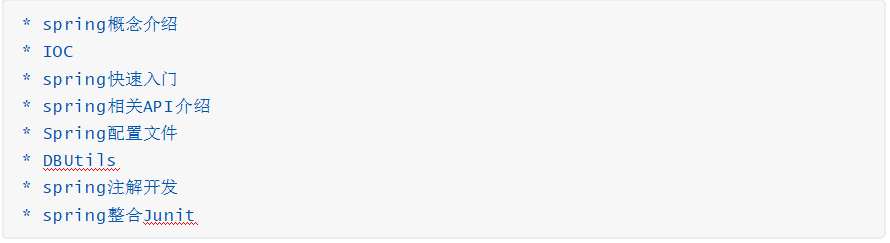

# **一**Spring概述


## **1.1** S***pring***是什么

Spring是分层的 Java SE/EE应用 **full-stack(**全栈式****) **轻量级开源框架**。

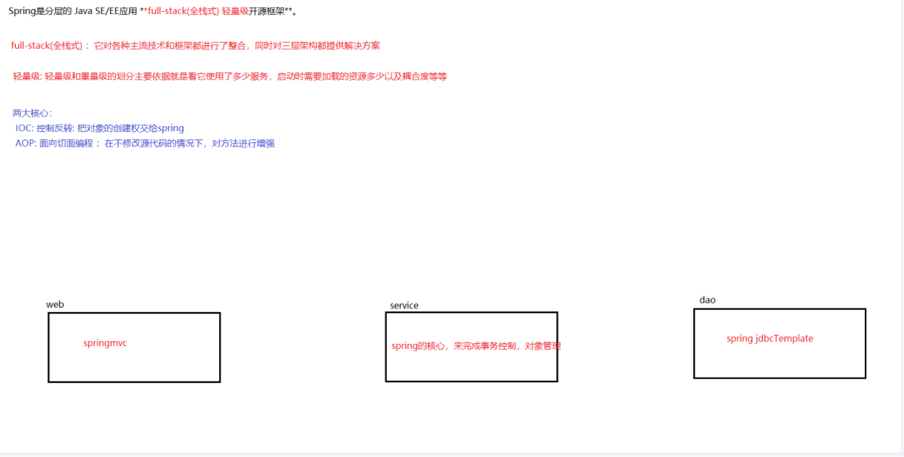

提供了**表现层** SpringMVC和**持久层** Spring JDBC Template以及 **业务层** 事务管理等众多的企业级应用技术，还能整合开源世界众多著名的第三方框架和类库，逐渐成为使用最多的Java EE 企业应用开源框架。

**两大核心**：以 **IOC**（Inverse Of Control：控制反转）和 **AOP**（Aspect Oriented Programming：面向切面编程）为内核。

 

##  1.2   Spring的发展历程

| 1997 | 年，IBM提出了EJB 的思想        |
| ---- | ------------------------------ |
| 1998 | 年，SUN制定开发标准规范 EJB1.0 |
| 1999 | 年，EJB1.1 发布                |
| 2001 | 年，EJB2.0 发布                |
| 2003 | 年，EJB2.1 发布                |
| 2006 | 年，EJB3.0 发布                |

 Spring

Rod Johnson（ Spring 之父） 改变Java世界的大师级人物

 

2002年编著《Expert one on one J2EE design and development》

指出了JavaEE和EJB组件框架中的存在的一些主要缺陷；提出普通java类依赖注入更为简单的解

决方案。

2004年编著《Expert one-on-one J2EE Development without EJB》阐述了JavaEE开发时不使用EJB的解决方式（Spring 雏形）

同年4月spring1.0诞生

2006年10月，发布 Spring2.0

2009年12月，发布 Spring3.0

2013年12月，发布 Spring4.0

2017年9月， 发布最新 Spring5.0 通用版（GA）


## **1.3** **Spring**优势


!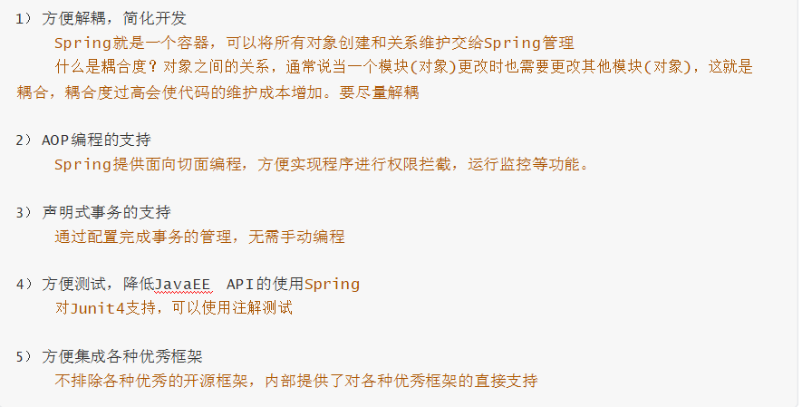

 

 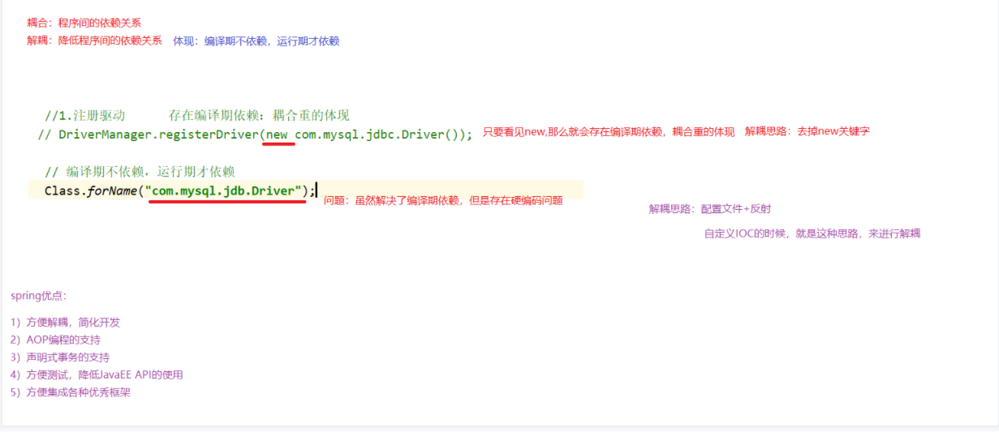

## **1.4** **Spring**体系结构

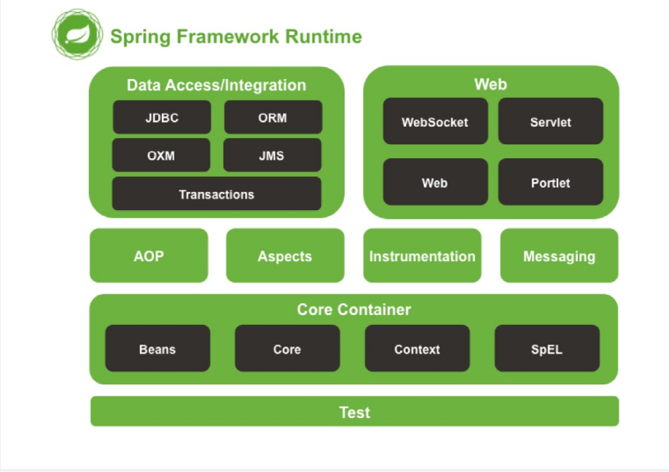


# **二   初识**IOC


## **2.1** **概述**

**控制反转（****Inverse  Of  Control****）不是什么技术，而是一种设计思想。它的目的是指导我们设计出更加松耦合的程序。

控制：在java中指的是对象的控制权限（创建、销毁）

反转：指的是对象控制权由原来 **由开发者在类中手动控制** 反转到 **由**Spring****容器控制****举个栗子


（1）传统方式

之前我们需要一个userDao实例，需要开发者自己手动创建 new UserDao();

 （2） IOC方式

现在我们需要一个userDao实例，直接从spring的IOC容器获得，对象的创建权交给了spring控制

反转：指的是对象控制权由原来 **由开发者在类中手动控制** 反转到 **由****Spring****容器控制****举个栗子**

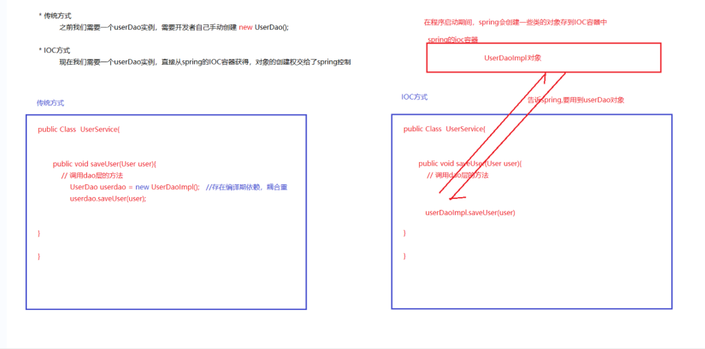

 

 

## **2.2** ***自定义IOC******容器***

### **2.2.1** ***介绍***

#### ***需求***

实现service层与dao层代码解耦合

#### ***步骤分析***

1. 创建java项目，导入自定义IOC相关坐标

2. 编写Dao接口和实现类

3. 编写Service接口和实现类

4. 编写测试代码

 

### **2.2.2** ***实现***

#### **1）** ***创建******java******项目，导入自定义******IOC******相关坐标***


```
<dependencies>
<dependency>
    <groupId>dom4j</groupId>
    <artifactId>dom4j</artifactId>
    <version>1.6.1</version>
</dependency>
<dependency>
    <groupId>jaxen</groupId>
    <artifactId>jaxen</artifactId>
    <version>1.1.6</version>
</dependency>
<dependency>
<groupId>junit</groupId>
<artifactId>junit</artifactId>
    <version>4.12</version>
</dependency>
</dependencies>
```

dom4j是用来解析配置文件的。

通常我们写完代码想要测试这段代码的正确性，那么必须新建一个类，然后创建一个 main() 方法，然后编写测试代码。如果需要测试的代码很多呢？那么要么就会建很多main() 方法来测试，要么将其全部写在一个 main() 方法里面。这也会大大的增加测试的复杂度，降低程序员的测试积极性。而 Junit 能很好的解决这个问题，简化单元测试，写一点测一点，在编写以后的代码中如果发现问题可以较快的追踪到问题的原因，减小回归错误的纠错难度。也就是使用@Test方法直接测试

**2）** **编写**Dao****接口和实现类

```
public interface IUserDao {
    public void save();
}
```

 

 

```
public class IUserDaoImpl implements IUserDao {
    public void save() {
        System.out.println("dao被调用了，保存成功");
    }
```

 

**3）** **编写**Service****接口和实现类

```
public interface IUserService {
    public void save();
}
```

 

```
public class IUserServiceImpl implements IUserService {
    public void save() {
        //调用DAO层代码  传统方式  存在编译期依赖，耦合重
        IUserDao userDao = new IUserDaoImpl();

        userDao.save();
    }
```


 

 

 

**4）** **编写测试代码**


```
public class SpringTest {
    @Test
    public void test01(){
        //获取业务层对象
        IUserService userService = new IUserServiceImpl();

        //调用save方法
        userService.save();

    }
```


 

**5）** **问题**


当前service对象和dao对象耦合度太高，而且每次new的都是一个新的对象，导致服务器压力过大。    解耦合的原则是编译期不依赖，而运行期依赖就行了。

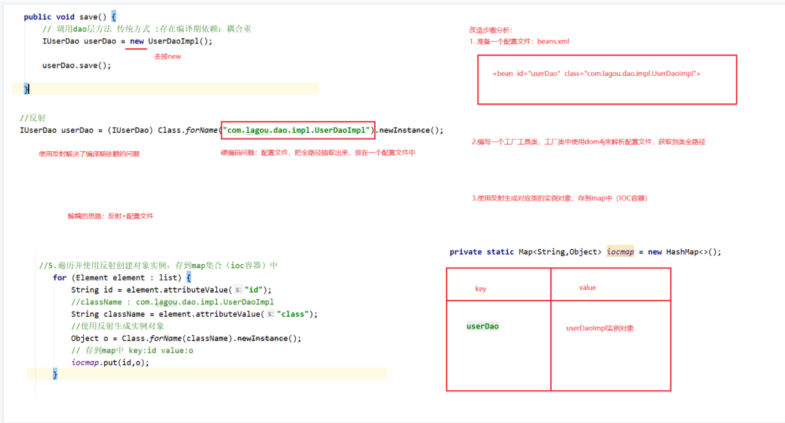

#### **6）** ***编写*****beans.xml**

把所有需要创建对象的信息定义在配置文件中(解决硬编码问题，就是在配置文件中配置）

```
<beans>

    <!--id是标识   class中存的就是生成实例的类的全路径-->
    <bean id ="UserDao" class = "com.cuiwei.dao.impl.IUserDaoImpl"></bean>


</beans>
```


 

#### **7）** ***编写******BeanFactory******工具类***


```
public class BeanFactory {

    private static Map<String,Object> iocmap = new HashMap<>();

    //程序启动时  初始化对象实例
    static {
        //1.读取配置文件(仅仅是加载)

        InputStream resourceAsStream = BeanFactory.class.getClassLoader().getResourceAsStream("beans.xml");

        //对配置文件进行解析
        SAXReader saxReader = new SAXReader();
        try {

            Document document = saxReader.read(resourceAsStream);

            //3.编写一个xpath的表达式

            String xpath = "//bean";

            //4.获取到所有的bean标签

            List<Element> list = document.selectNodes(xpath);

            //5.遍历并使用反射创建对象的实例  ，存在Map集合中（ioc容器）

            for (Element element : list) {
                String id = element.attributeValue("id");

                //className的值就是IUserDaoImpl的全路径
                String className = element.attributeValue("class");

                //使用反射生成实例对象
                Object o = Class.forName(className).newInstance();

                //需要存到Map集合中
                iocmap.put(id, o);

            }
        } catch (Exception e) {
            e.printStackTrace();


        }
    }

    public static Object getBean(String beanId){
        Object o = iocmap.get(beanId);
        return o;
    }
```

 这里的getBean方法来获取Map集合中的id，从而获取到你的对象。

使用static静态代码块，是因为static静态代码块是类编译时候就会执行。

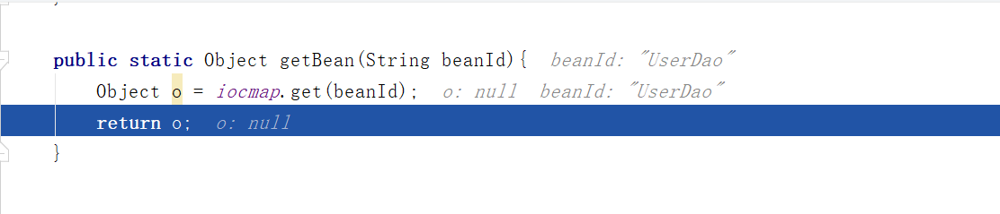

 这里出现了空指针异常  是因为在<bean>标签里的id多了一个空格，而导致我的代码里面获取不到id因为id要和<bean>标签里的保持一致。

 

**8）** **修改***serServiceImpl****实现类


```
public void test02() {

    IUserDao userDao = (IUserDao) BeanFactory.getBean("UserDao");

    userDao.save();
}
```

## **2.2.3** **知识小结**


```
* 其实升级后的BeanFactory就是一个简单的Spring的IOC容器所具备的功能。

 

* 之前我们需要一个userDao实例，需要开发者自己手动创建 new UserDao();

 
* 现在我们需要一个userdao实例，直接从spring的IOC容器获得，对象的创建权交给了spring控制

 

* 最终目标：代码解耦合

 
```

# **三** **Spring**快速入门


## **3.1** **介绍**

**需求**：借助spring的IOC实现service层与dao层代码解耦合**步骤分析**

步骤分析：

1. ```
   1. 创建java项目，导入spring开发基本坐标
   
   2. 编写Dao接口和实现类
   
   3. 创建spring核心配置文件
   
   4. 在spring配置文件中配置 UserDaoImpl
   
   5. 使用spring相关API获得Bean实例
   ```

   


## **3.2** 代码实现

### **1）** 创建java项目，导入spring开发基本坐标


```
<dependencies>
    <dependency>
        <groupId>org.springframework</groupId>
        <artifactId>spring-context</artifactId>
        <version>5.1.5.RELEASE</version>
    </dependency>
    <dependency>
        <groupId>junit</groupId>
        <artifactId>junit</artifactId>
        <version>4.12</version>
    </dependency>
</dependencies>
```

 

 

**2）** **编写**Dao****接口和实现类


```
public interface UserDao {
    public void save();
}
```

```
public class UserDaoimpl  implements UserDao {

    public void save() {
        System.out.println("dao被调用了");
    }
}
```

**3）** **创建**spring****核心配置文件


```
<?xml version="1.0" encoding="UTF-8"?>
<beans xmlns="http://www.springframework.org/schema/beans" xmlns:xsi="http://www.w3.org/2001/XMLSchema-instance" xsi:schemaLocation="http://www.springframework.org/schema/beans
http://www.springframework.org/schema/beans/spring-beans.xsd">

</beans>
```

**4）** **在****spring****配置文件中配置** **UserDaoImpl**


```
<!--在Spring配置文件中配置UserDaoImpl-->
<!--id唯一标识-->
<!--calss是实现类的全路径-->
<bean id="userDao" class="com.cuiwei.dao.impl.UserDaoimpl"></bean>
```

**5）** **使用****spring****相关****API****获得****Bean****实例


```
public void tese01(){

    //获取到了Spring上下文对象，能够以获取到IOC容器中的bean对象，加载并同时创建了Bean对象存在容器中
   ApplicationContext classPathXmlApplicationContext = new ClassPathXmlApplicationContext("applicationContext.xml");


   //使用上下文对象从IOC容器中获取到了bean对象
   UserDao userDao = (UserDao) classPathXmlApplicationContext.getBean("userDao");

   //调用方法
   userDao.save();

}
```

 

## **3.3** **知识小结**

Spring的开发步骤

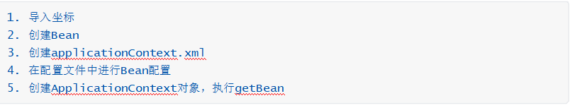

# **四** ***Spring******相关******API***


## **4.1** ***API*****继承体系介绍**

Spring的API体系异常庞大，我们现在只关注两个BeanFactory和ApplicationContext

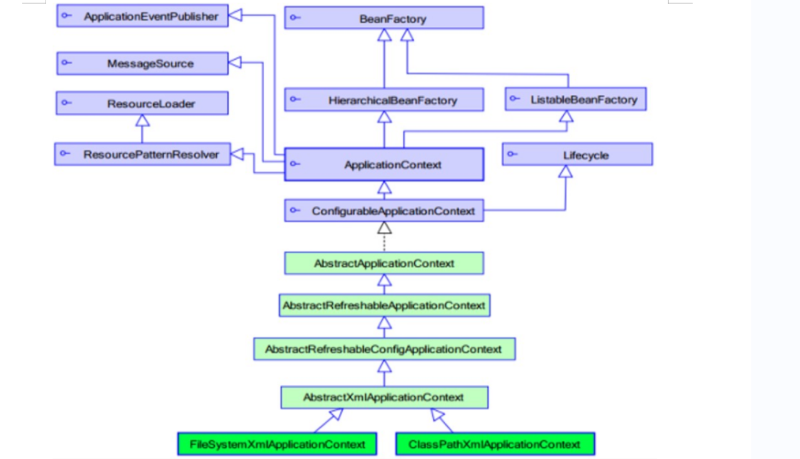

 

## **4.2** ***BeanFactory***


```
public  void test02(){
//核心接口，不会创建bean对象存在容器中
    XmlBeanFactory xmlBeanFactory = new XmlBeanFactory(new ClassPathResource("applicationContext.xml"));
//getbean才真正创建Bean对象
   UserDao userDao = (UserDao) xmlBeanFactory.getBean("userDao");

   userDao.save();
   
}
```

BeanFactory是 IOC 容器的核心接口，它定义了IOC的基本功能。特点：在第一次调用getBean()方法时，创建指定对象的实例


 

 

## **4.3** ***ApplicationContext***

代表应用上下文对象，可以获得spring中IOC容器的Bean对象。 特点：在spring容器启动时，加载并创建所有对象的实例

#### ***\*常用实现类\****


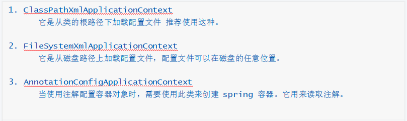


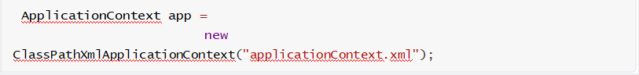

 

**常用方法**：


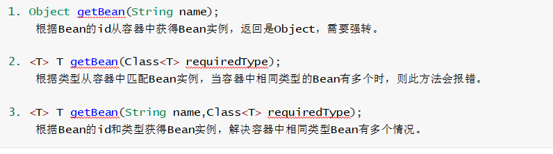


 2方法的缺点在于，一个接口可能有多个实现类，就会报错，Spring不知道你要返回哪个对象。

 

**4.4** **知识小结**


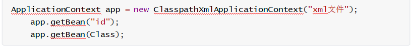


 

 

# **五** **Spring**配置文件


## **5.1** **Bean**标签基本配置


**<bean id="" class=""></bean>**

 用于配置对象交由Spring来创建。

 基本属性：

​         id：Bean实例在Spring容器中的唯一标识

​        class：Bean的全限定名，也就是全路径（底层使反射进行创建）

  默认情况下它调用的是类中的 无参构造函数，如果没有无参构造函数则不能创建成功。 


 

 

## **5.2** **Bean**标签范围配置

<bean id="" class="" scope=""></bean>

scope属性指对象的作用范围，取值如下：

| **取值范围**   | **说明**                                                     |
| -------------- | ------------------------------------------------------------ |
| **singleton**  | 默认值，单例的                                               |
| **prototype**  | 多例的                                                       |
| request        | WEB项目中，Spring创建一个Bean的对象，将对象存入到request域中 |
| session        | WEB项目中，Spring创建一个Bean的对象，将对象存入到session域中 |
| global session | WEB项目中，应用在Portlet环境，如果没有Portlet环境那么globalSession 相当于 session |

最后看从bean中获取出来的对象的地址是否相等，相等则是单例，不相等则是多例。

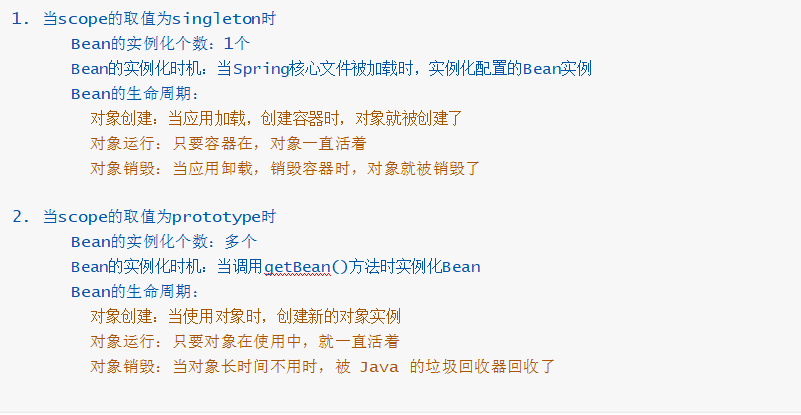

## **5.3** ***Bean******生命周期配置***

```
<bean id="userDao" class="com.cuiwei.dao.impl.UserDaoimpl" scope="singleton" init-method="init" destroy-method="destroy">
</bean>
```

 init-method方法是创建实例后进行初始化

destroy-method方法是容器销毁方法。

## **5.4** **Bean**实例化三种方式

无参**构造**方法

实例化工厂**静态**方法

实例化工厂**普通**方法实例化

 

### **5.4.1** ***无参构造方法实例化***

它会根据默认无参构造方法来创建类对象，如果bean中没有默认无参构造函数，将会创建失败

<bean>标签默认就是无参构造方法 

### **5.4.2** ***工厂静态方法实例化***

#### ***应用场景***

依赖的jar包中有个A类，A类中有个静态方法m1，m1方法的返回值是一个B对象。如果我们频繁使用B对象，此时我们可以将B对象的创建权交给spring的IOC容器，以后我们在使用B对象时，无需调用A类     中的m1方法，直接从IOC容器获得。

```
public class StaticFactoryBean {
    public static UserDao creatUserDao(){
        return new UserDaoimpl();
    }
```

```
<bean id="userDao" class="com.cuiwei.factory.StaticFactoryBean" factory-method="creatUserDao"></bean>
```

这里的factory-method是为了说明你要调用哪个方法，并获取该方法的返回结果 

### **5.4.3** ***工厂普通方法实例化***

#### ***应用场景***

依赖的jar包中有个A类，A类中有个普通方法m1，m1方法的返回值是一个B对象。如果我们频繁使用

B对象，

此时我们可以将B对象的创建权交给spring的IOC容器，以后我们在使用B对象时，无需调用A类中的m1   方法，直接从IOC容器获得。

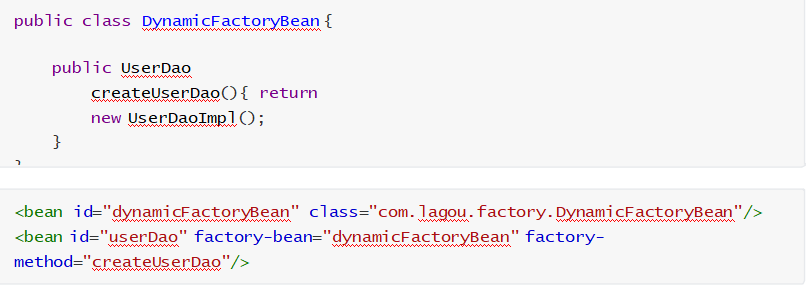


 与工厂静态方法的区别就是，方法不是静态的，不能直接创建对象直接调用。只能先创建工厂，再调用方法

 

 

## **5.5** ***Bean***依**赖注入概述**

**依赖注入** **DI**（****Dependency Injection****）：它是 Spring 框架核心 IOC 的具体实现。

在编写程序时，通过控制反转，把对象的创建交给了 Spring，但是代码中不可能出现没有依赖的情况。IOC 解耦只是降低他们的依赖关系，但不会消除。例如：业务层仍会调用持久层的方法。

那这种业务层和持久层的依赖关系，在使用 Spring 之后，就让 Spring 来维护了。简单的说，就是**通过框架把持久层对象传入业务层**，而不用我们自己去获取。


## **5.6** Bean依赖注入方式


### 普通方法注入：

配置Spring容器调用无参构造

```
<bean id="userDao" class="com.cuiwei.dao.impl.UserDaoimpl"></bean>
```

```
<bean id="userService" class="com.cuiwei.service.impl.UserServiceimpl"></bean>
```

 

### **5.6.1** ***构造方法***

在UserServiceImpl中创建有参构造


```
private UserDao userDao;


//有参数构造
public UserServiceimpl(UserDao userDao) {
    this.userDao = userDao;
}

public void save() {
    //调用Dao层对象
    userDao.save();

}
```


 

配置Spring容器调用有参构造时进行注入

```
 <bean id="userDao" class="com.cuiwei.dao.impl.UserDaoimpl"></bean>
```

```
<bean id="userService" class="com.cuiwei.service.impl.UserServiceimpl">

        <!--constructor-arg index="0" type="com.cuiwei.dao.UserDao" ref="userDao"></constructor-arg>-->
        <constructor-arg name="userDao" ref="userDao"></constructor-arg>

    </bean>
```

 


 这里的index = 0是获取有参方法中第一个参数的值，type是第一个参数值的类型，ref是为了引用IOC容器的哪个对象注入给第一个参数

name要等于有参方法中的参数名。

 

### **5.6.2** set方法(最常用)

在UserServiceImpl中创建set方法


```
public class UserServiceimpl implements UserService {

    private UserDao userDao;


   /* //有参数构造
    public UserServiceimpl(UserDao userDao) {
        this.userDao = userDao;
    }
*/

    public void setUserDao(UserDao userDao) {
        this.userDao = userDao;
    }

    public void save() {
        //调用Dao层save方法
        userDao.save();

    }
}
```

 、


 

配置Spring容器调用set方法进行注入

```
<bean id="userDao" class="com.cuiwei.dao.impl.UserDaoimpl"></bean>
```

 <bean id="userService" class="com.cuiwei.service.impl.UserServiceimpl">

```
<!-利用set方法依赖注入-->
<property name="userDao" ref="userDao"></property>   等同于编写了userService.setUserDao(userDao)
```

```
</bean>
```

注意：ref引入对象，注入userDao对象

### **5.6.3** ***P******命名空间注入***

P命名空间注入本质也是set方法注入，但比起上述的set方法注入更加方便，主要体现在配置文件中，如下：

#### ***首先，需要引入P*命名空间：**

```
<?xml version="1.0" encoding="UTF-8"?>
<beans xmlns="http://www.springframework.org/schema/beans" 
       xmlns:xsi="http://www.w3.org/2001/XMLSchema-instance"
       xmlns:p ="http://www.springframework.org/schema/p"
       xsi:schemaLocation="http://www.springframework.org/schema/beans
        http://www.springframework.org/schema/beans/spring-beans.xsd">
```

 那么在进行set注入的时候就不用再写property标签了，直接在<bean>标签里写一个p:userDao;

**其次，需要修改注入方式：**


```
<bean id="userDao" class="com.lagou.dao.impl.UserDaoImpl"/>

<bean id="userService" class="com.lagou.service.impl.UserServiceImpl" p:userDao-ref="userDao"/> 
```


 

 

## **5.7** **Bean**依赖注入的数据类型

上面操作，都是注入Bean对象，除了对象的引用可以注入，普通数据类型和集合都可以在容器中进行注入。

注入数据的三种数据类型

### **5.7.1.** **普通数据类型**

**2.** **引用数据类型**

**3.** **集合数据类型**

其中引用数据类型，此处就不再赘述了，之前的操作都是对UserDao对象的引用进行注入的。下面将以set方法注入为例，演示普通数据类型和集合数据类型的注入。

### *5.7.1*2 注入普通数据类型


```
public class UserDaoimpl  implements UserDao {

    private  String username;
    private  Integer age;

    public void setUsername(String username) {
        this.username = username;
    }

    public void setAge(Integer age) {
        this.age = age;
    }

    public void save() {
        System.out.println(username + age);
        System.out.println("dao被调用了");
    }
```

 


配置文件：


```
<bean id="userDao" class="com.cuiwei.dao.impl.UserDaoimpl">
    <!--ref是引用数据类型的注入    Value是普通类型的注入-->
    <property name="username" value="cuiwei"></property>
    <property name="age" value="18"></property>

</bean>
```

 

 

### **5.7.23 **注入集合数据类型

#### **1）** ***List*****集合注入**

```
private List<Object> list;

public void setList(List<Object> list) {
    this.list = list;
}
```

配置文件;

```
<bean id="user" class="com.cuiwei.domain.User">
    <property name="username" value="崔巍"></property>
    <property name="age" value="18"></property>
</bean>
```

```
<bean id="userDao" class="com.cuiwei.dao.impl.UserDaoimpl">
    <!--ref是引用数据类型的注入    Value是普通类型的注入-->
    <property name="username" value="cuiwei"></property>
    <property name="age" value="18"></property>

    <!--通过list集合数据类型注入-->
    <property name="list">
        <list>
        <value>aaaaa</value>
        <ref bean="user"></ref>
        </list>
    </property>

</bean>
```

**2）** **Set**集合注入

private Set<Object> set;

public void setSett(Set<Object> set) {
    this.set = set;
}

配置文件：

        <bean id="user" class="com.cuiwei.domain.User">
        <property name="username" value="崔巍"></property>
        <property name="age" value="18"></property>
    </bean>
    
    <bean id="userDao" class="com.cuiwei.dao.impl.UserDaoimpl">
        <!--ref是引用数据类型的注入    Value是普通类型的注入-->
        <property name="username" value="cuiwei"></property>
        <property name="age" value="18"></property>
        
        <!--进行set集合数据类型的注入-->
            <property name="set">
               <set>
                   <value>bbbb</value>
                   <ref bean="user"></ref>
               </set>
            </property>
       </bean>


**3）** **Array**数组注入

```
private  Object[] array;
public void setArray(Object[] array) {
    this.array = array;
}
```

 

配置文件：


    <bean id="user" class="com.cuiwei.domain.User">
        <property name="username" value="崔巍"></property>
        <property name="age" value="18"></property>
    </bean>
    
     <bean id="userDao" class="com.cuiwei.dao.impl.UserDaoimpl">
        <!--ref是引用数据类型的注入    Value是普通类型的注入-->
        <property name="username" value="cuiwei"></property>
        <property name="age" value="18"></property>
    
    <!--通过array数组数据类型注入-->
    <property name="array">
        <array>
        <value>cccc</value>
        <ref bean="user"></ref>
        </array>
    </property>
    </bean>

**4）** **Map**集合注入

配置文件：

```
<!--进行Map集合数据类型的注入-->
<property name="map">
    <map>
        <entry key="k1" value="ddd"></entry>
        <entry key = "k2" value-ref="user"></entry>
    </map>
</property>
```

注意：这里和上面的三种不一样。 


 

**5）** **Properties**配置注入

配置文件：

```
<!--进行properties数据类型的注入-->
<property name="properties">
    <props>
        <prop key="k1">v1</prop>
        <prop key="k2">v2</prop>
    </props>
</property>
```


 


## **5.8** **配置文件模块化**

实际开发中，Spring的配置内容非常多，这就导致Spring配置很繁杂且体积很大，所以，可以将部分配置拆解到其他配置文件中，也就是所谓的**配置文件模块化**。

### **1）** **并列的多个配置文件**


 ClassPathXmlApplicationContext classPathXmlApplicationContext = new ClassPathXmlApplicationContext("applicationContext.xml"，“另一个配置文件的名称“);


 

 

### **2）** **主从配置文件**

```
<import resource="applicationContext_dao.xml"></import>
```

 

注意：

同一个xml中不能出现相同名称的bean,如果出现会报错

多个xml如果出现相同名称的bean，不会报错，但是后加载的会覆盖前加载的bean

 

## **5.9** ***知识小结***

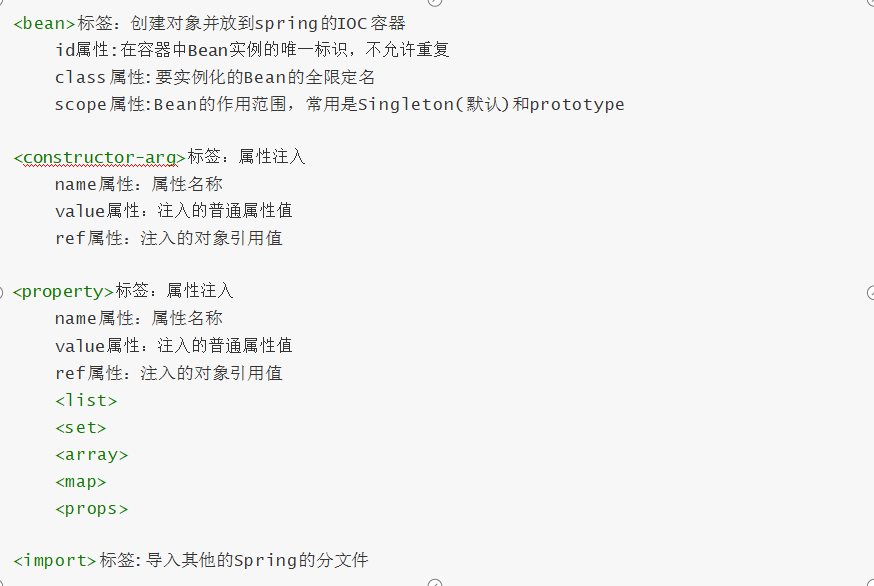

# ***六*** ***DbUtils******（******IOC******实战）***

## **6.1** ***DbUtils是什么？***

DbUtils是Apache的一款用于简化Dao代码的工具类，它底层封装了JDBC技术。

#### **核心对象**

 QueryRunner queryRunner = new QueryRunner(DataSource dataSource)

**核心方法**

int update(); 执行增、删、改语句

T qury(); 执行查询语句

ResultSetHandler<T> 这是一个接口，主要作用是将数据库返回的记录封装到实体对象

 之前使用数据库连接池进行数据库的操作。

查询数据库所有账户信息到Account实体中


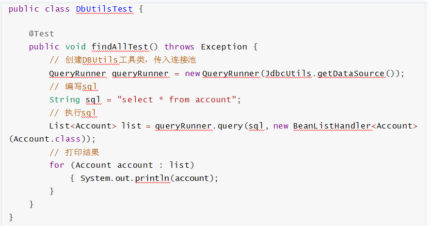


 

 

## **6.2** ***Spring******的******xml******整合******DbUtils***

### **6.1** ***介绍***

#### ***需求***

基于Spring的xml配置实现账户的CRUD案例

#### ***步骤分析***

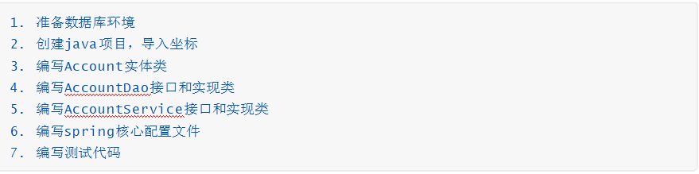

## **6.2** **实现**

**1）** **准备数据库环境**


```sql
 CREATE DATABASE `spring_db`;
USE `spring_db`;
CREATE TABLE `account` (
`id` INT(11) NOT NULL AUTO_INCREMENT,
`name` VARCHAR(32) DEFAULT NULL,
`money` DOUBLE DEFAULT NULL, PRIMARY KEY (`id`)
) ;


INSERT	INTO `account`(`id`,`name`,`money`) VALUES (1,'tom',1000), (2,'jerry',1000);

```


**2）** **创建**java****项目，导入坐标

```
<dependencies>

    <dependency>

        <groupId>mysql</groupId>

        <artifactId>mysql-connector-java</artifactId>

        <version>5.1.47</version>

    </dependency>

    <dependency>

        <groupId>com.alibaba</groupId>

        <artifactId>druid</artifactId>

        <version>1.1.9</version>

    </dependency>

    <dependency>

        <groupId>commons-dbutils</groupId>

        <artifactId>commons-dbutils</artifactId>

        <version>1.6</version>

    </dependency>

    <dependency>

        <groupId>org.springframework</groupId>

        <artifactId>spring-context</artifactId>

        <version>5.1.5.RELEASE</version>

    </dependency>

    <dependency>

        <groupId>junit</groupId>

        <artifactId>junit</artifactId>

        <version>4.12</version>

    </dependency>

</dependencies>
```


**3）** **编写**Account****实体类

```java
public class Account {
    private Integer id;
    private String name;
    private Double money;

    public Integer getId() {
        return id;
    }

    public void setId(Integer id) {
        this.id = id;
    }

    public String getName() {
        return name;
    }

    public void setName(String name) {
        this.name = name;
    }

    public Double getMoney() {
        return money;
    }

    public void setMoney(Double money) {
        this.money = money;
    }

    @Override
    public String toString() {
        return "Account{" +
                "id=" + id +
                ", name='" + name + '\'' +
                ", money=" + money +
                '}';
    }
}
```

 


 

 

**4）** **编写**AccountDao****接口和实现类

接口：

```java
public interface AccountDao {
    
    public List<Account> findAll();
    
    public Account findById();
    
    public void save (Account account);
    
    public void updare(Account account);
    
    public void delete(Integer id);
    
    
}
```

 

 实现类：

 

```java
public class AccountImpl implements AccountDao {

    private QueryRunner queryRunner ;

    public void setQueryRunner(QueryRunner queryRunner) {
        this.queryRunner = queryRunner;
    }

    public List<Account> findAll() {
        List<Account> list = null;
        //编写Sql
        String sql = "select * from account";
        try {
            //执行Sql
            list = queryRunner.insert(sql, new BeanListHandler<Account>(Account.class));
        } catch (SQLException e) {
            e.printStackTrace();
        }
        return  list;
    }

    public Account findById() {

        Account query = null;
        //编写Sql
        String sql = "select *  from account where id =?";
        try {
             query = queryRunner.query(sql, new BeanHandler<Account>(Account.class));
        } catch (SQLException e) {
            e.printStackTrace();
        }
        return query;
    }

    public void save(Account account) {
        
        
        //编写Sql
        String sql = "insert into account values(null,?,?)";
        try {
            queryRunner.update(sql,account.getName(),account.getMoney());
        } catch (SQLException e) {
            e.printStackTrace();
        }

    }

    public void updare(Account account) {
        
        String sql = "update account set name = ?,money = ? where id = ?";

        try {
            queryRunner.update(sql,account.getName(),account.getMoney(),account.getId());
        } catch (SQLException e) {
            e.printStackTrace();
        }

    }

    public void delete(Integer id) {
        
        String sql = "delete from account where id = ?";

        try {
            queryRunner.update(sql,id);
        } catch (SQLException e) {
            e.printStackTrace();
        }

    }
}
```

注意：

 QreryRunner类(org.apache.commons.dbutils.QueryRunner) 是Dbutils的核心类之一，它显著的简化了SQL查询，并与ResultSetHandler协同工作将使编码量大为减少。

其中ResultSetHandler接口(org.apache.commons.dbutils.ResultSethandler)执行处理一个结果集对象，将数据转变并处理为任何一种形式，供其他应用使用。实现类如下：

- ArrayHandler：把结果集中的第一行数据转成对象数组。
- ArrayListHandler：把结果集中的每一行数据都转成一个对象数组，再存放到List中。
- BeanHandler：将结果集中的第一行数据封装到一个对应的JavaBean实例中。
- BeanListHandler：将结果集中的每一行数据都封装到一个对应的JavaBean实例中，存放到List里。
- ColumnListHandler：将结果集中某一列的数据存放到List中。
-  KeyedHandler：将结果集中的每一行数据都封装到一个Map里，然后再根据指定的key把每个Map再存放到一个Map里。
-  MapHandler：将结果集中的第一行数据封装到一个Map里，key是列名，value就是对应的值。
-  MapListHandler：将结果集中的每一行数据都封装到一个Map里，然后再存放到List。
-  ScalarHandler：将结果集中某一条记录的其中某一列的数据存成Object。

#### **5）** ***编写AccountService***接口和实现类


接口：

```java
public interface AccountService {

    public List<Account> findAll();

    public Account findById(Integer id);

    public void save (Account account);

    public void update(Account account);

    public void delete(Integer id);
}
```

实现类：

```java
public class AccountServiceImpl implements AccountService {

    private AccountDao accountDao;

    public void setAccountDao(AccountDao accountDao) {
        this.accountDao = accountDao;
    }

    public List<Account> findAll() {
      return accountDao.findAll();
    }

    public Account findById(Integer id) {
        return accountDao.findById(id);
    }

    public void save(Account account) {
            accountDao.save(account);
    }

    public void update(Account account) {
            accountDao.update(account);
    }

    public void delete(Integer id) {
            accountDao.delete(id);
    }
}
```

**6）** **编写**spring****核心配置文件

applicationContext.xml


```java
<?xml version="1.0" encoding="UTF-8"?>
<beans xmlns="http://www.springframework.org/schema/beans"
       xmlns:xsi="http://www.w3.org/2001/XMLSchema-instance"
       xmlns:p ="http://www.springframework.org/schema/p"
       xsi:schemaLocation="http://www.springframework.org/schema/beans
        http://www.springframework.org/schema/beans/spring-beans.xsd">
    
    <!--dateSource 使用的有参构造方法    把数据库连接池交给IOC容器e-->
    <bean id="dataSource" class="com.alibaba.druid.pool.DruidDataSource">
        <property name="driverClassName" value="com.mysql.jdbc.Driver"></property>
        <property name="url" value="jdbc:mysql:///spring_db"></property>
        <property name="username" value="root"></property>
        <property name="password" value="123456"></property>
     </bean>
    
    <!--queryRunner   把QueryRunner交给IOC容器-->
    <bean id="queryRunner" class="org.apache.commons.dbutils.QueryRunner">
        <constructor-arg name="ds" ref="dataSource"></constructor-arg>
    </bean>
    
    <!--AccountDao   把AccountDao交给IOC容器-->
    <bean id="accountDao" class="com.cuiwei.dao.impl.AccountImpl">
        <!--使用set方法对querRunner进行注入-->
       <property name="queryRunner" ref="queryRunner"></property>
    </bean>

    <!--AccountService   <!--把AccountService交给IOC容器-->-->
    <bean id="accountService" class="com.cuiwei.service.impl.AccountServiceImpl">
        <property name="accountDao" ref="accountDao"></property>
    </bean>

</beans>
```

 首先，queryRunner使用的是有参数的构造方法，所以首先要把DataSource先进行注入，然后将其注入到queryRunner中，

AccountDao中需要queryRunner,把queryRunner注入到AccountDao中，最后将AccountDao注入到AccountService中。


#### **7）** *编写测试代码*

```java
public class AccountServiceTest {

    ClassPathXmlApplicationContext classPathXmlApplicationContext = new ClassPathXmlApplicationContext("applicationContext.xml");
    AccountService accountService = (AccountService)classPathXmlApplicationContext.getBean("accountService");


    //测试添加
    @Test
    public void testsave(){
        Account account = new Account();
        account.setName("cuiwei");
        account.setMoney(888d);
        accountService.save(account);
    }


    //测试查询（根据ID擦查询）
    @Test
    public void testFindById(){
        Account account = accountService.findById(1);
        System.out.println(account);
    }

    //测试查询所有
    @Test
    public void testfindAll(){
        List<Account> all = accountService.findAll();
        for (Account account : all) {
            System.out.println(account);
        }
    }

    //测试更新
    @Test
    public void update(){
        Account account = new Account();
        account.setId(3);
        account.setName("lihuikang");
        account.setMoney(400d);
        accountService.update(account);
    }


    //测试删除
    @Test
    public void delete(){
        accountService.delete(3);
    }

}
```

 


 

**8）** **抽取**jdbc****配置文件


applicationContext.xml加载jdbc.properties配置文件获得连接信息。

 **首先，需要引入context命名空间和约束路径：**

```xml
/*命名空间*/
xmlns:context="http://www.springframework.org/schema/context"
```

```
/*约束空间*/
http://www.springframework.org/schema/context
http://www.springframework.org/schema/beans/spring-context.xsd
```

 

```java
<bean id="dataSource" class="com.alibaba.druid.pool.DruidDataSource">
    <property name="driverClassName" value="${jdbc.driverClassName}"></property>
    <property name="url" value="${jdbc.url}"></property>
    <property name="username" value="${jdbc.username}"></property>
    <property name="password" value="${jdbc.password}"></property>
 </bean>
```

## **6.3** ***知识小结*** 

```
*DataSource的创建权交由Spring容器去完成

*QueryRunner的创建权交由Spring容器去完成，使用构造方法传递DataSource

*Spring容器加载properties文件
<context:property-placeholder location="xx.properties"/>
<property name="" value="${key}"/>
```

 

 

# **七** **Spring**注解开发

Spring是轻代码而重配置的框架，配置比较繁重，影响开发效率，所以注解开发是一种趋势，注解代替xml配置文件可以简化配置，提高开发效率。

 

## **7.1** ***Spring*****常用注解**

### **7.1.1** ***介绍***

Spring常用注解主要是替代<bean> 的配置

 前四个注解相当于配置了<bean>标签   (作用是生成类的实例对象存到IOC容器中)

中间四个相当于配置property（要进行依赖注入）

| **注解**        | **说明**                                                     |
| --------------- | ------------------------------------------------------------ |
| **@Component**  | 使用在类上用于实例化Bean                                     |
| **@Controller** | 使用在web层类上用于实例化Bean                                |
| **@Service**    | 使用在service层类上用于实例化Bean                            |
| **@Repository** | 使用在dao层类上用于实例化Bean                                |
| **@Autowired**  | 使用在字段上用于根据类型依赖注入                             |
| **@Qualifier**  | **结合@Autowired**一起使用，不能单独使用,根据名称进行依赖注入。 |
| **@Resource**   | 相当于@Autowired+@Qualifier，按照名称进行注入                |
| **@Value**      | 注入普通属性                                                 |
| **@Scope**      | 标注Bean的作用范围                                           |
| @PostConstruct  | 使用在方法上标注该方法是Bean的初始化方法                     |
| @PreDestroy     | 使用在方法上标注该方法是Bean的销毁方法                       |

#### ***说明：***

JDK11以后完全移除了javax扩展导致不能使用@resource注解，如果要用

```
<dependency>
<groupId>javax.annotation</groupId>
<artifactId>javax.annotation-api</artifactId>
<version>1.3.2</version>
</dependency>
```

 

 @Scope注意事项:

单例：所有请求用同一个对象来处理。通过单例模式，可以保证系统中一个类只有一个实例。
多例：每个请求用一个新的对象来处理。

2，Spring中的单例与多例
spring ioc容器的bean都是默认单例的，即spring依赖注入Bean实例默认是单例的。

spring提供了5中scope，分别是singleton，prototype，request，session，global session，常用是前两种。点此查看官网介绍。

单例bean与多例（原型）bean的区别：
如果一个bean被声明为单例的时候，在处理多次请求的时候，在spring容器里只实例化出一个bean，后续的请求都公用这个对象，这个对象会保存在一个map里面。当有请求来的时候，会先从缓存（map）里查看有没有，有的话直接使用这个对象，没有的话才实例化一个新的对象，所以这是个单例的。但是对于原型（prototype）bean来说，当每次请求来的时候，会直接实例化新的bean，没有缓存以及缓存查询的过程。

#### ***注意***

使用注解进行开发时，需要在applicationContext.xml中配置组件扫描，作用是指定哪个包及其子包  下的Bean需要进行扫描以便识别使用注解配置的类、字段和方法。

 

```
<!--注解的组件扫描-->
<context:component-scan base-package="com.lagou"></context:component-scan>
```

 

 

### **7.1.2** ***实现***

#### **1）** ***Bean******实例化（******IOC******）***


```
<!--AccountDao-->
<bean id="accountDao" class="com.cuiwei.dao.impl.AccountDaoImpl"></bean>
```

 


 

使用@Compont或@Repository标识UserDaoImpl需要Spring进行实例化。


```
@Service(value = "accountService")   //相当于配置了bean标签  value相当于bean标签的id
public class AccountServiceImpl implements AccountService
```


#### **2）** 属性依赖注入

```
  <property name="queryRunner" ref="queryRunner"></property>
```

使用@Autowired或者@Autowired+@Qulifier或者@Resource进行userDao的注入

 

```
@Autowired //根据数据类型注入（用的最多）
private AccountDao accountDao;
```


#### **3）** ***@Value***

使用@Value进行字符串的注入，结合EL表达式获得配置参数


 

```
@Value("注入普通属性")  //注入普通属性的值
    private String str;

    @Value("${jdbc.driverClassName}")
    private String driver;
```


 

 

#### **4）** ***@Scope***


```
<bean scope=""/>
```

使用@Scope标注Bean的范

```
@Scope("prototype")
public class AccountServiceImpl implements AccountService {
```


 

#### **5）** ***Bean******生命周期***


 

```
<bean init-method="init" destroy-method="destory" />
```


 

使用@PostConstruct标注初始化方法，使用@PreDestroy标注销毁方法

```
@PostConstruct public void init(){
System.out.println("初始化方法	");
}

@PreDestroy
public void destroy(){ System.out.println("销毁方法	");
```

 


## **7.2** ***Spring常用注解整合******DbUtils***

#### 步骤分析

 

```
1.拷贝xml配置项目，改为注解配置项目
2.修改AccountDaoImpl实现类
3.修改AccountServiceImpl实现类
4.修改spring核心配置文件
5.编写测试代码
```

**1）** **拷贝**xml****配置项目，改为常用注解配置项目

```
.....
```

**2）** **修改**AccountDaoImpl****实现类


 

```
package com.cuiwei.dao.impl;

import com.cuiwei.dao.AccountDao;
import com.cuiwei.domain.Account;
import org.apache.commons.dbutils.QueryRunner;
import org.apache.commons.dbutils.handlers.BeanHandler;
import org.apache.commons.dbutils.handlers.BeanListHandler;
import org.springframework.beans.factory.annotation.Autowired;
import org.springframework.stereotype.Repository;

import java.sql.SQLException;
import java.util.List;
@Repository //相当于配置了bean标签
public class AccountDaoImpl implements AccountDao {
    @Autowired
    private QueryRunner queryRunner ;


    public void setQueryRunner(QueryRunner queryRunner) {
        this.queryRunner = queryRunner;
    }

    public List<Account> findAll() {
        List<Account> list = null;
        //编写Sql
        String sql = "select * from account";
        try {
            //执行Sql
            list = queryRunner.query(sql, new BeanListHandler<Account>(Account.class));
        } catch (SQLException e) {
            e.printStackTrace();
        }
        return  list;
    }

    public Account findById(Integer id) {

        Account query = null;
        //编写Sql
        String sql = "select *  from account where id =?";
        try {
             query = queryRunner.query(sql, new BeanHandler<Account>(Account.class),id);
        } catch (SQLException e) {
            e.printStackTrace();
        }
        return query;
    }

    public void save(Account account) {


        //编写Sql
        String sql = "insert into account values(null,?,?)";
        try {
            queryRunner.update(sql,account.getName(),account.getMoney());
        } catch (SQLException e) {
            e.printStackTrace();
        }

    }

    public void update(Account account) {

        String sql = "update account set name = ?,money = ? where id = ?";

        try {
            queryRunner.update(sql,account.getName(),account.getMoney(),account.getId());
        } catch (SQLException e) {
            e.printStackTrace();
        }

    }

    public void delete(Integer id) {

        String sql = "delete from account where id = ?";

        try {
            queryRunner.update(sql,id);
        } catch (SQLException e) {
            e.printStackTrace();
        }

    }
}
```


 

 

**3）** **修改AccountServiceImpl**实现类

```
package com.cuiwei.service.impl;

import com.cuiwei.dao.AccountDao;
import com.cuiwei.domain.Account;
import com.cuiwei.service.AccountService;
import org.springframework.beans.factory.annotation.Autowired;
import org.springframework.beans.factory.annotation.Value;
import org.springframework.context.annotation.Scope;
import org.springframework.stereotype.Service;

import java.util.List;

@Service(value = "accountService")   //相当于配置了bean标签  value相当于bean标签的id
@Scope("prototype")
public class AccountServiceImpl implements AccountService {

    @Autowired //根据数据类型注入
    private AccountDao accountDao;


    public List<Account> findAll() {

      return accountDao.findAll();
    }

    public Account findById(Integer id) {
        return accountDao.findById(id);
    }

    public void save(Account account) {
            accountDao.save(account);
    }

    public void update(Account account) {
            accountDao.update(account);
    }

    public void delete(Integer id) {
            accountDao.delete(id);
    }
}
```

 


 

 

**4）** **修改**spring****核心配置文件

```
<?xml version="1.0" encoding="UTF-8"?>
<beans xmlns="http://www.springframework.org/schema/beans"
       xmlns:xsi="http://www.w3.org/2001/XMLSchema-instance"
       xmlns:context="http://www.springframework.org/schema/context"
       xsi:schemaLocation="
        http://www.springframework.org/schema/beans
        http://www.springframework.org/schema/beans/spring-beans.xsd
      http://www.springframework.org/schema/context
       http://www.springframework.org/schema/context/spring-context.xsd
">

    <!--在加载application配置文件的同时也把jdbc.properties文件也加载了-->
    <context:property-placeholder location="classpath:jdbc.properties"></context:property-placeholder>


    <!--注解扫描-->
    <context:component-scan base-package="com.cuiwei"></context:component-scan>

    <!--dateSource 使用的有参构造方法-->
       <bean id="dataSource" class="com.alibaba.druid.pool.DruidDataSource">
        <property name="driverClassName" value="${jdbc.driverClassName}"></property>
        <property name="url" value="${jdbc.url}"></property>
        <property name="username" value="${jdbc.username}"></property>
        <property name="password" value="${jdbc.password}"></property>
    </bean>

    <!--queryRunner-->
    <bean id="queryRunner" class="org.apache.commons.dbutils.QueryRunner">
        <constructor-arg name="ds" ref="dataSource"></constructor-arg>
    </bean>

</beans>
```


 

 

**5）** **编写测试代码**

```
package com.cuiwei.test;

import com.cuiwei.domain.Account;
import com.cuiwei.service.AccountService;
import org.junit.Test;
import org.springframework.context.support.ClassPathXmlApplicationContext;

import java.util.List;

public class AccountServiceTest {

    ClassPathXmlApplicationContext classPathXmlApplicationContext = new ClassPathXmlApplicationContext("applicationContext.xml");
    AccountService accountService = (AccountService)classPathXmlApplicationContext.getBean("accountService");


    //测试添加
    @Test
    public void testsave(){
        Account account = new Account();
        account.setName("cuiwei");
        account.setMoney(888d);
        accountService.save(account);
    }


    //测试查询（根据ID擦查询）
    @Test
    public void testFindById(){
        Account account = accountService.findById(1);
        System.out.println(account);
    }

    //测试查询所有
    @Test
    public void testfindAll(){
        List<Account> all = accountService.findAll();
        for (Account account : all) {
            System.out.println(account);
        }
    }

    //测试更新
    @Test
    public void update(){
        Account account = new Account();
        account.setId(3);
        account.setName("lihuikang");
        account.setMoney(400d);
        accountService.update(account);
    }


    //测试删除
    @Test
    public void delete(){
        accountService.delete(3);
    }

}
```

 


 

 

## **7.3** **Spring**注解

使用上面的注解还不能全部替代xml配置文件，还需要使用注解替代的配置如下：


```
*非自定义的Bean的配置：<bean>

*加载properties文件的配置：<context:property-placeholder>

*组件扫描的配置：<context:component-scan>

*引入其他文件：<import>
```


| **注解**                     | **说明**                                                     |
| ---------------------------- | ------------------------------------------------------------ |
| @Configuration（核心配置类） | 用于指定当前类是一个Spring 配置类，当创建容器时会从该类上加载注解 |
| @Bean                        | 使用在方法上，标注将该方法的返回值存储到 Spring 容器中       |
| @PropertySource              | 用于加载 properties 文件中的配置                             |
| @ComponentScan               | 用于指定 Spring 在初始化容器时要扫描的包                     |
| @Import                      | 用于导入其他配置类                                           |

 

 

## **7.4** Spring纯注解整合DbUtils

#### ****步骤分析


```
1.拷贝xml配置项目，改为注解配置项目
2.修改AccountDaoImpl实现类
3.修改AccountServiceImpl实现类
4.修改spring核心配置文件
5.编写测试代码
```

**1）** **编写**Spring****核心配置类

```
@Configuration
@ComponentScan("com.cuiwei")
@Import(DataSourceConfig.class)
public class springConfig {


    @Bean("queryRunner")
    public QueryRunner getQueryRunner(@Autowired  DataSource dataSource){
        QueryRunner queryRunner = new QueryRunner(dataSource);
        return queryRunner;
    }

}
```

 

这里使用Import将数据库配置信息的类导入到核心配置类中。

这里的@Bean(),里面可以设置Key值，而他的Value值就是该方法的返回值，如果不设置，它默认使用的是方法名，也就是getQueryRunner。

 这里的@Autowired  DataSource dataSource配置的其实就是核心配置文件中的<constructor-arg name="ds" ref="dataSource"></constructor-arg>（它的意思就是根据DataSource这个类型，从IOC容器中将其注入给dataSource）

 

**2）** **编写数据库配置信息类**

```
<!--在加载application配置文件的同时也把jdbc.properties文件也加载了-->
<context:property-placeholder location="classpath:jdbc.properties"></context:property-placeholder>
```

```
@PropertySource("classpath:jdbc.properties") //括号里写的就是原配置文件中location的值。
public class DataSourceConfig {
    @Value("${jdbc.driverClassName}")
    private String driver;
    @Value("${jdbc.url}")
    private  String url;
    @Value("${jdbc.username}")
    private String username;
    @Value("${jdbc.password}")
    private String password;

    @Bean("dataSource")
    public DataSource getDataSource(){


        DruidDataSource druidDataSource = new DruidDataSource();
        druidDataSource.setDriverClassName(driver);
        druidDataSource.setUrl(url);
        druidDataSource.setUsername(username);
        druidDataSource.setPassword(password);
        return druidDataSource;


    }
}
```

这里用的EL表达式  ${},就是找到jdbc.properties中的值，然后将其赋值给类中的成员变量。


**3）** **编写测试代码**


```
AnnotationConfigApplicationContext configApplicationContext =  new AnnotationConfigApplicationContext(springConfig.class);
AccountService accountService = (AccountService) configApplicationContext.getBean("accountService");
```

 

因为这里已经没有了applicationConfig.xml，所以不能以前那种加载配置文件的方式了，已经用注解方式进行替代，所以在加载配置文件时候要用AnnotationConfigApplicationContext(springConfig.class).

 

 

# **八** **Spring**整合****Junit


**8.1** **普通**Junit****测试问题

在普通的测试类中，需要开发者手动加载配置文件并创建Spring容器，然后通过Spring相关API获得Bean实例；如果不这么做，那么无法从容器中获得对象。

我们可以让SpringJunit负责创建Spring容器来简化这个操作，开发者可以直接在测试类注入Bean实  例；但是需要将配置文件的名称告诉它。

 

## **8.2** ***Spring****整合****Junit*

#### ***步骤分析***

```
1.导入spring集成Junit的坐标
2.使用@Runwith注解替换原来的运行器
3.使用@ContextConfiguration指定配置文件或配置类
4.使用@Autowired注入需要测试的对象
5.创建测试方法进行测试
```

**1）** **导入**spring****集成****Junit****的坐标

```
<!--此处需要注意的是，spring5 及以上版本要求 junit 的版本必须是 4.12 及以上-->
<dependency>
<groupId>org.springframework</groupId>
<artifactId>spring-test</artifactId>
<version>5.1.5.RELEASE</version>
</dependency>
<dependency>
<groupId>junit</groupId>
<artifactId>junit</artifactId>
<version>4.12</version>
<scope>test</scope>
</dependency>
```


**2）** **使用**@Runwith****注解替换原来的运行器

```
@RunWith(SpringJUnit4ClassRunner.class) //@RunWith是指定的junit运行环境，SpringJUnit4ClassRunner是Spring提供的作为junit运行环境的一个类
public class AccountServiceTest {
}
```

**3）** **使用**@ContextConfiguration****指定配置文件或配置类

```
@RunWith(SpringJUnit4ClassRunner.class)

//@ContextConfiguration(value = {"classpath:applicationContext.xml"}) 加载spring 核心配置文件

@ContextConfiguration(classes = {SpringConfig.class}) // 加载spring核心配置类

public class SpringJunitTest {

 

}
```

**4）** **使用**@Autowired****注入需要测试的对象

```
@RunWith(SpringJUnit4ClassRunner.class) 
@ContextConfiguration(classes = {SpringConfig.class}) public class SpringJunitTest {

 

@Autowired

private AccountService accountService;


```

采用{}的作用是，可能有多个加载类，如果有多个，就直接在{}里面写。

**5）** **创建测试方法进行测试**

```java
@RunWith(SpringJUnit4ClassRunner.class) @ContextConfiguration(classes = {SpringConfig.class}) public class SpringJunitTest {

@Autowired
private AccountService accountService;

//测试查询@Test
public void testFindById() {
Account account = accountService.findById(3);
System.out.println(account);
  }
}
```

