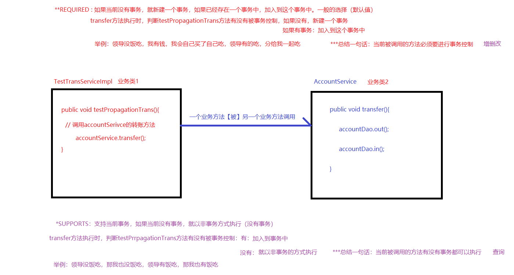

# **Spring JDBCTemplate  **声明式事务


课程任务主要内容：

```
*Spring的JdbcTemplate
*Spring的事务
*Spring集成web环境
```

## **一** **Spring**的****JdbcTemplate

### **1.1** **JdbcTemplate**是什么？

JdbcTemplate是spring框架中提供的一个模板对象，是对原始繁琐的Jdbc API对象的简单封装。

**核心对象**

 DataSource是数据源对象

数据源，简单理解为数据源头，提供了应用程序所需要数据的位置。数据源保证了应用程序与目标数据之间交互的规范和协议，它可以是数据库，文件系统等等。其中数据源定义了位置信息，用户验证信息和交互时所需的一些特性的配置，同时它封装了如何建立与数据源的连接，向外暴露获取连接的接口。应用程序连接数据库无需关注其底层是如何如何建立的，也就是说应用业务逻辑与连接数据库操作是松耦合的


```
JdbcTemplate jdbcTemplate = new JdbcTemplate(DataSource dataSource);
```

**核心方法**

 

```
int update(); 执行增、删、改语句
List<T>	query(); 查询多个
T queryForObject(); 查询一个
new BeanPropertyRowMapper<>(); 实现ORM映射封装
```

**举个栗子**

查询数据库所有账户信息到Account实体中

```
public class JdbcTemplateTest {

@Test
public void testFindAll() throws Exception {
// 创建核心对象
JdbcTemplate jdbcTemplate = new JdbcTemplate(JdbcUtils.getDataSource());
// 编写sql
String sql = "select * from account";
// 执行sql
List<Account> list = jdbcTemplate.query(sql, new BeanPropertyRowMapper<> (Account.class));
   }
}
```

 注意：

 new BeanPropertyRowMapper可自动将一行数据映射到指定类的实例中 它首先将这个类实例化，然后通过**名称匹配**的方式，映射到属性中去。

  new BeanPropertyRowMapper<Account>(Account.class),括号中的Account.class别忘了

### **1.2** **Spring**整合****JdbcTemplate

#### **需求**

基于Spring的xml配置实现账户的CRUD案例

#### **步骤分析**

 

```
1.创建java项目，导入坐标
2.编写Account实体类
3.编写AccountDao接口和实现类
4.编写AccountService接口和实现类
5.编写spring核心配置文件
6.编写测试代码
```


#### **1）** **创建**java****项目，导入坐标


 配置文件：

```
<dependencies>
<dependency>
    <groupId>mysql</groupId>
    <artifactId>mysql-connector-java</artifactId>
    <version>5.1.47</version>
</dependency>
//数据库连接池
<dependency>
    <groupId>com.alibaba</groupId>
    <artifactId>druid</artifactId>
    <version>1.1.15</version>
</dependency>
<dependency>
    <groupId>org.springframework</groupId>
    <artifactId>spring-context</artifactId>
    <version>5.1.5.RELEASE</version>
</dependency>
//AOP坐标
<dependency>
    <groupId>org.aspectj</groupId>
    <artifactId>aspectjweaver</artifactId>
    <version>1.8.13</version>
</dependency>
//jdbctemplate   -tx是事务依赖
<dependency>
    <groupId>org.springframework</groupId>
    <artifactId>spring-jdbc</artifactId>
    <version>5.1.5.RELEASE</version>
</dependency>
    <dependency>
        <groupId>org.springframework</groupId>
        <artifactId>spring-tx</artifactId>
        <version>5.1.5.RELEASE</version>
    </dependency>
    <dependency>
        <groupId>junit</groupId>
        <artifactId>junit</artifactId>
        <version>4.12</version>
    </dependency>
    <dependency>
        <groupId>org.springframework</groupId>
        <artifactId>spring-test</artifactId>
        <version>5.1.5.RELEASE</version>
    </dependency>
</dependencies>
```


 

 

#### **2）** **编写**account****实体类

```
public class Account {
    private  Integer id;
    private  String name;
    private Double money;

    public Integer getId() {
        return id;
    }

    public void setId(Integer id) {
        this.id = id;
    }

    public String getName() {
        return name;
    }

    public void setName(String name) {
        this.name = name;
    }

    public Double getMoney() {
        return money;
    }

    public void setMoney(Double money) {
        this.money = money;
    }

    @Override
    public String toString() {
        return "Account{" +
                "id=" + id +
                ", name='" + name + '\'' +
                ", money=" + money +
                '}';
    }
}
```

 

#### **3）** **编写a**ccountDao****接口和实现类

 

接口:

```
public interface AccountDao {
    /**
     * 查询所有用户
     * @return
     */
    public List<Account> finAll();

    /**
     * 根据ID查询账户
     */
    public Account findById(Integer id);

    /**
     * 添加账户
     */
    public void save(Account account);


    /**
     * 更新账户
     */
    public void update(Account account);


    /**
     * 根据ID删除用户
     *
     */

    public void delete(Integer id);
}
```


实现类：

```
@Repository
public class AccountDaoimpl implements AccountDao {

    @Autowired
    private JdbcTemplate jdbcTemplate;
    /**
     * 查询所有账户
     * @return
     */
    public List<Account> finAll() {
        //需要用到JdbcTemplate
        String sql = "select * from account";
        List<Account> list = jdbcTemplate.query(sql, new BeanPropertyRowMapper<Account>(Account.class));
        return list;

    }

    /**
     * 根据ID查询账户
     * @return
     */
    public Account findById(Integer id) {
        String sql = "select * from account where id = ?";
        Account account = jdbcTemplate.queryForObject(sql, new BeanPropertyRowMapper<Account>(Account.class), id);
        return account;
    }

    /**
     * 添加账户
     * @param account
     */

    public void save(Account account) {
        String sql = "insert into account values(null,?,?)";
        jdbcTemplate.update(sql,account.getName(),account.getMoney());
    }

    /**
     * 更新用户信息
     * @param account
     */
    public void update(Account account) {

        String sql = "update account set money = ? where name = ?";
        jdbcTemplate.update(sql,account.getMoney(),account.getName());
    }

    /**
     * 根据ID删除账户
     * @param id
     */
    public void delete(Integer id) {

        String sql = "delete from account where id = ?";
        jdbcTemplate.update(sql,id);
    }
}
```


#### **4）** ***编写******AccountService******接口和实现类***


接口：

```
public interface AccountService {
    /**
     * 查询所有用户
     * @return
     */
    public List<Account> finAll();

    /**
     * 根据ID查询账户
     */
    public Account findById(Integer id);

    /**
     * 添加账户
     */
    public void save(Account account);


    /**
     * 更新账户
     */
    public void update(Account account);


    /**
     * 根据ID删除用户
     *
     */

    public void delete(Integer id);


}
```

实现类：

```
@Service
public class AccountServiceImpl implements AccountService {

    @Autowired
    private AccountDao accountDao;

    public List<Account> finAll() {
        List<Account> list = accountDao.finAll();
        return list;
    }

    public Account findById(Integer id) {
        Account account = accountDao.findById(id);
        return account;
    }

    public void save(Account account) {
        accountDao.save(account);
    }

    public void update(Account account) {
        accountDao.update(account);
    }

    public void delete(Integer id) {
            accountDao.delete(id);
    }
}
```

 

#### **5）** **编写**spring****核心配置文件


 

```
<?xml version="1.0" encoding="UTF-8"?>
<beans xmlns="http://www.springframework.org/schema/beans"
       xmlns:xsi="http://www.w3.org/2001/XMLSchema-instance"
       xmlns:context="http://www.springframework.org/schema/context"
       xsi:schemaLocation="
               http://www.springframework.org/schema/beans
               http://www.springframework.org/schema/beans/spring-beans.xsd
               http://www.springframework.org/schema/context
               http://www.springframework.org/schema/context/spring-context.xsd">


    <context:property-placeholder location="classpath:jdbc.properties"></context:property-placeholder>
    <!--配置IOC注解扫描-->
    <context:component-scan base-package="com.cuiwei"></context:component-scan>


    <!--关于数据源-->
    <bean id="dataSource" class="com.alibaba.druid.pool.DruidDataSource">
        <property name="driverClassName" value="${jdbc.driverClassName}"></property>
        <property name="url" value="${jdbc.url}"></property>
        <property name="username" value="${jdbc.username}"></property>
        <property name="password" value="${jdbc.password}"></property>
    </bean>

    <!--配置JDBCTemplate-->
     <bean id="jdbcTemplate" class="org.springframework.jdbc.core.JdbcTemplate">
         <constructor-arg ref="dataSource" name="dataSource"></constructor-arg>
     </bean>

</beans>
```


jdbc.properties文件：

```
jdbc.driverClassName=com.mysql.jdbc.Driver
jdbc.url=jdbc:mysql:///spring_db
jdbc.username=root
jdbc.password=123456
```

#### **6）** **编写测试代码**

```
@RunWith(SpringJUnit4ClassRunner.class)
@ContextConfiguration({"classpath:applicationContext.xml"})
public class AccountServiceTest {
    @Autowired
    private AccountService accountService;

    private Account account;


    /**
     * 测试添加
     */
    @Test
    public void testSave(){
        Account account = new Account();
        account.setName("cuiwei");
        account.setMoney(1200d);
        accountService.save(account);
    }


    /**
     * 测试查询
     *
     */
    @Test
    public void testSelect(){
        List<Account> list = accountService.finAll();
        for (Account account1 : list) {
            System.out.println(account1);
        }
    }


    /**
     * 根据ID进行查询
     */
    @Test
    public void testFindById(){
        Account account = accountService.findById(1);
        System.out.println(account);
    }

    /**
     * 测试刚更新
     */
    @Test
    public void testupdate(){
      Account account = new Account();
      account.setMoney(1500d);
      account.setName("cuiwei");
      accountService.update(account);
    }


    /**
     * 根据ID删除用户
     */
    @Test
    public void testdelete(){
        accountService.delete(4);
    }
}
```


### **1.3 **实现转账案例

### *步骤分析*

```
1.创建java项目，导入坐标
2.编写Account实体类
3.编写AccountDao接口和实现类
4.编写AccountService接口和实现类
5.编写spring核心配置文件
6.编写测试代码
```

#### **1）** **创建**java****项目，导入坐标

```
<dependencies>
<dependency>
    <groupId>mysql</groupId>
    <artifactId>mysql-connector-java</artifactId>
    <version>5.1.47</version>
</dependency>
<dependency>
    <groupId>com.alibaba</groupId>
    <artifactId>druid</artifactId>
    <version>1.1.15</version>
</dependency>
<dependency>
    <groupId>org.springframework</groupId>
    <artifactId>spring-context</artifactId>
    <version>5.1.5.RELEASE</version>
</dependency>
    <dependency>
        <groupId>org.aspectj</groupId>
        <artifactId>aspectjweaver</artifactId>
        <version>1.8.13</version>
    </dependency>
    <dependency>
        <groupId>org.springframework</groupId>
        <artifactId>spring-jdbc</artifactId>
        <version>5.1.5.RELEASE</version>
    </dependency>
    <dependency>
        <groupId>org.springframework</groupId>
        <artifactId>spring-tx</artifactId>
        <version>5.1.5.RELEASE</version>
    </dependency>
    <dependency>
        <groupId>junit</groupId>
        <artifactId>junit</artifactId>
        <version>4.12</version>
    </dependency>
    <dependency>
        <groupId>org.springframework</groupId>
        <artifactId>spring-test</artifactId>
        <version>5.1.5.RELEASE</version>
    </dependency>
</dependencies>
```


#### **2）** **编写**Account****实体类

```
public class Account {
    private Integer id;
    private String name;
    private Double meney;

    public Integer getId() {
        return id;
    }

    public void setId(Integer id) {
        this.id = id;
    }

    public String getName() {
        return name;
    }

    public void setName(String name) {
        this.name = name;
    }

    public Double getMeney() {
        return meney;
    }

    public void setMeney(Double meney) {
        this.meney = meney;
    }

    @Override
    public String toString() {
        return "Account{" +
                "id=" + id +
                ", name='" + name + '\'' +
                ", meney=" + meney +
                '}';
    }
}
```

#### **3）** **编写**AccountDao****接口和实现类

接口：

```
/**
 * 减钱   转出操作
 */
public void out(String outUser,Double money);

/**
 * 加钱，转入操作
 */
public void in(String inUser,Double money);
```

 实现类：

```
@Repository
public class AccountDaoImpl implements AccountDao {

    @Autowired
    private JdbcTemplate jdbcTemplate;

    public void out(String outUser, Double money) {
        String sql = "update account set money = money - ? where name = ?";
        jdbcTemplate.update(sql,money,outUser);
    }

    public void in(String inUser, Double money) {
        String sql = "update account set money = money + ? where name = ?";
        jdbcTemplate.update(sql,money,inUser);
    }
}
```

#### **4）** **编写**AccountService****接口和实现类

接口;

```
public interface AccountService {
    /**
     * 转账方法
     *
     */

    public void transfer(String outUser,String inUser,Double money);
}
```

实现类;

```
@Service
public class AccountServiceImpl implements AccountService {
    @Autowired
    private AccountDao accountDao;

    /**
     * 转账方法
     * @param outUser
     * @param inUser
     * @param money
     */
    public void transfer(String outUser, String inUser, Double money) {
        /**
         * 调用Dao层的out和in方法
         */
        accountDao.out(outUser,money);

          accountDao.in(inUser,money);
    }
}
```

**5）** **编写**spring****核心配置文件

```
<?xml version="1.0" encoding="UTF-8"?>
<beans xmlns="http://www.springframework.org/schema/beans"
       xmlns:xsi="http://www.w3.org/2001/XMLSchema-instance"
       xmlns:context="http://www.springframework.org/schema/context"
       xsi:schemaLocation="
               http://www.springframework.org/schema/beans
               http://www.springframework.org/schema/beans/spring-beans.xsd
               http://www.springframework.org/schema/context
               http://www.springframework.org/schema/context/spring-context.xsd">

    <context:property-placeholder location="classpath:jdbc.properties"></context:property-placeholder>

    <context:component-scan base-package="com.cuiwei"></context:component-scan>

    <bean id="dataSource" class="com.alibaba.druid.pool.DruidDataSource">
        <property name="driverClassName" value="${jdbc.driverClassName}"></property>
        <property name="url" value="${jdbc.url}" ></property>
        <property name="username" value="${jdbc.username}"></property>
        <property name="password" value="${jdbc.password}"></property>
    </bean>

    <bean id="jdbcTemplate" class="org.springframework.jdbc.core.JdbcTemplate">
        <constructor-arg name="dataSource" ref="dataSource"></constructor-arg>
    </bean>
</beans>
```

 


jdbc.properties文件：

```
jdbc.driverClassName=com.mysql.jdbc.Driver
jdbc.url=jdbc:mysql:///spring_db
jdbc.username=root
jdbc.password=123456
```


**6）** **编写测试代码**

```
@RunWith(SpringJUnit4ClassRunner.class)
@ContextConfiguration({"classpath:applicationContext.xml"})
public class AccountServiceTest {

    @Autowired
    private AccountService accountService;

    @Test
    public void testTransfer(){
        accountService.transfer("tom","jerry",100d);
    }
}
```

 

## **二** **Spring**的事务


### **2.1** **Sping**中的事务控制方式

Spring的事务控制可以分为编程式事务控制和声明式事务控制。

**编程式**

开发者直接把事务的代码和业务代码耦合到一起，在实际开发中不用。

**声明式**

开发者采用配置的方式来实现的事务控制，业务代码与事务代码实现解耦合，使用的AOP思想。


### **2.2** **编程式事务控制相关对象【了解】**

#### **2.2.1** **PlatformTransactionManager**

PlatformTransactionManager接口，是spring的事务管理器，里面提供了我们常用的操作事务的方法。

 

| **方法**                                                     | **说明**                    |
| ------------------------------------------------------------ | --------------------------- |
| TransactionStatus getTransaction(TransactionDefinition definition); | 开启事务 获取事务的状态信息 |
| void commit(TransactionStatus status)；                      | 提交事务                    |
| void rollback(TransactionStatus status)；                    | 回滚事务                    |

**注意：**

```
*PlatformTransactionManager 是接口类型，不同的 Dao 层技术则有不同的实现类。

*Dao层技术是jdbcTemplate或mybatis时： DataSourceTransactionManager

*Dao层技术是hibernate时：
HibernateTransactionManager

*Dao层技术是JPA时：
JpaTransactionManager
```

 

#### **2.2.2** **TransactionDefinition**

TransactionDefinition接口提供事务的定义信息（事务隔离级别、事务传播行为等等）

| **方法**                     | **说明**           |
| ---------------------------- | ------------------ |
| int getIsolationLevel()      | 获得事务的隔离级别 |
| int getPropogationBehavior() | 获得事务的传播行为 |
| int getTimeout()             | 获得超时时间       |
| boolean isReadOnly()         | 是否只读           |

##### **1）** **事务隔离级别**

```
* ISOLATION_DEFAULT 使用数据库默认级别 

* ISOLATION_READ_UNCOMMITTED 读未提交 

* ISOLATION_READ_COMMITTED 读已提交 

* ISOLATION_REPEATABLE_READ 可重复读 

* ISOLATION_SERIALIZABLE 串行化 
```

设置隔离级别，可以解决事务并发产生的问题，如脏读、不可重复读和虚读（幻读）。

A事务读取B事务尚未提交的数据，此时如果B事务发生错误并执行回滚操作，那么A事务读取到的数据就是脏数据。就好像原本的数据比较干净、纯粹，此时由于B事务更改了它，这个数据变得不再纯粹。这个时候A事务立即读取了这个脏数据，但事务B良心发现，又用回滚把数据恢复成原来干净、纯粹的样子，而事务A却什么都不知道，最终结果就是事务A读取了此次的脏数据，称为脏读。

这种情况常发生于转账与取款操作中


 

 

【2】不可重复读（前后多次读取，数据内容不一致）
事务A在执行读取操作，由整个事务A比较大，前后读取同一条数据需要经历很长的时间 。而在事务A第一次读取数据，比如此时读取了小明的年龄为20岁，事务B执行更改操作，将小明的年龄更改为30岁，此时事务A第二次读取到小明的年龄时，发现其年龄是30岁，和之前的数据不一样了，也就是数据不重复了，系统不可以读取到重复的数据，成为不可重复读。


 

备注

按照正确逻辑，事务A前后两次读取到的数据应该一致

 

【3】幻读（前后多次读取，数据总量不一致）
事务A在执行读取操作，需要两次统计数据的总量，前一次查询数据总量后，此时事务B执行了新增数据的操作并提交后，这个时候事务A读取的数据总量和之前统计的不一样，就像产生了幻觉一样，平白无故的多了几条数据，成为幻读。

##### **2）** **事务传播行为**

事务传播行为指的就是当一个业务方法【被】另一个业务方法调用时，应该如何进行事务控制。

 

| **参数**      | **说明**                                                     |
| ------------- | ------------------------------------------------------------ |
| **REQUIRED**  | 如果当前没有事务，就新建一个事务，如果已经存在一个事务中，加入到这个事务中。一般的选择（默认值） |
| **SUPPORTS**  | 支持当前事务，如果当前没有事务，就以非事务方式执行（没有事务） |
| MANDATORY     | 使用当前的事务，如果当前没有事务，就抛出异常                 |
| REQUERS_NEW   | 新建事务，如果当前在事务中，把当前事务挂起                   |
| NOT_SUPPORTED | 以非事务方式执行操作，如果当前存在事务，就把当前事务挂起     |
| NEVER         | 以非事务方式运行，如果当前存在事务，抛出异常                 |
| NESTED        | 如果当前存在事务，则在嵌套事务内执行。如果当前没有事务，则执行REQUIRED 类似的操作 |

 注意：



#### **2.2.3** **TransactionStatus**

TransactionStatus 接口提供的是事务具体的运行状态。

 

| **方法**                   | **说明**     |
| -------------------------- | ------------ |
| boolean isNewTransaction() | 是否是新事务 |
| boolean hasSavepoint()     | 是否是回滚点 |
| boolean isRollbackOnly()   | 事务是否回滚 |
| boolean isCompleted()      | 事务是否完成 |

 

可以简单的理解三者的关系：**事务管理器**通过读取**事务定义参数**进行事务管理，然后会产生一系列的**事** **务状态**。


#### **2.2.4** 实现代码

##### **1）** ***配置文件***

```java
<!--事务管理器交给IOC-->
<bean id="transactionManager" class="org.springframework.jdbc.datasource.DataSourceTransactionManager">
<property name="dataSource" ref="dataSource"/>
</bean>
```

##### **2）** **业务层代码**

```java
@Service
public class AccountServiceImpl implements AccountService { @Autowired
private AccountDao accountDao;

@Autowired
private PlatformTransactionManager transactionManager;

@Override
public void transfer(String outUser, String inUser, Double money) {
// 创建事务定义对象
DefaultTransactionDefinition def = new DefaultTransactionDefinition();
// 设置是否只读，false支持事务
def.setReadOnly(false);
// 设置事务隔离级别，可重复读mysql默认级别
def.setIsolationLevel(TransactionDefinition.ISOLATION_REPEATABLE_READ);
// 设置事务传播行为，必须有事务
def.setPropagationBehavior(TransactionDefinition.PROPAGATION_REQUIRED);
// 配置事务管理器
TransactionStatus status = transactionManager.getTransaction(def);

try {
// 转账
accountDao.out(outUser, money); accountDao.in(inUser, money);

// 提交事务
transactionManager.commit(status);
} catch (Exception e) { e.printStackTrace();
// 回滚事务
transactionManager.rollback(status);
}
}
}
```

#### **2.2.5** **知识小结**

Spring中的事务控制主要就是通过这三个API实现的

```
*PlatformTransactionManager 负责事务的管理，它是个接口，其子类负责具体工作

*TransactionDefinition 定义了事务的一些相关参数

*TransactionStatus 代表事务运行的一个实时状态
```

 

理解三者的关系：**事务管理器**通过读取**事务定义参数**进行事务管理，然后会产生一系列的**事务状态**。

 

### **2.3** ***基于******ML******的声明式事务控制【重点】***

在 Spring 配置文件中声明式的处理事务来代替代码式的处理事务。底层采用AOP思想来实现的。

**声明式事务控制明确事项：**

核心业务代码(目标对象) （切入点是谁？）

事务增强代码(Spring已提供事务管理器)）（通知是谁？） 切面配置（切面如何配置？）

 

**2.3.1** **快速入门**

##### **需求**

使用spring声明式事务控制转账业务。

##### **步骤分析**

```
1.引入tx命名空间

2.事务管理器通知配置

3.事务管理器AOP配置

4.测试事务控制转账业务代码
```

##### **1）** **引入**tx****命名空间

 

```
<?xml version="1.0" encoding="UTF-8"?>
<beans xmlns="http://www.springframework.org/schema/beans"
       xmlns:xsi="http://www.w3.org/2001/XMLSchema-instance"
       xmlns:context="http://www.springframework.org/schema/context"
       xmlns:tx="http://www.springframework.org/schema/tx"
       xsi:schemaLocation="
               http://www.springframework.org/schema/beans
               http://www.springframework.org/schema/beans/spring-beans.xsd
               http://www.springframework.org/schema/context
               http://www.springframework.org/schema/context/spring-context.xsd
                  http://www.springframework.org/schema/tx
               http://www.springframework.org/schema/tx/spring-tx.xsd">
```

##### **2）** **事务管理器通知配置**


 

```
<!--事务管理器对象-->
<bean id="transactionManager" class="org.springframework.jdbc.datasource.DataSourceTransactionManager">
    <property name="dataSource" ref="dataSource"></property>
</bean>


<!--通知增强-->
<tx:advice id="txAdvice" transaction-manager="transactionManager">
    <!--定义事务的一些属性   *表示现在任意名称的方法都是默认配置-->
    <tx:attributes>
        <tx:method name="*"/>
    </tx:attributes>
</tx:advice>
```


 

 

##### **3）** **事务管理器**AOP****配置

```
--aop配置   配置切面-->
<aop:config>
    <aop:advisor advice-ref="txAdvice" pointcut="execution(* com.cuiwei.service.imol.AccountServiceImpl.*(..))"></aop:advisor>
</aop:config>
```


注意：只有声明式控制配置切面时候使用aop:adviso。

##### **4）** **测试事务控制转账业务代码**


#### **2.3.2** **事务参数的配置详解**


```
<tx:method name="transfer" isolation="REPEATABLE_READ" propagation="REQUIRED" timeout="-1" read-only="false"/>

*name：切点方法名称

*isolation:事务的隔离级别

*propogation：事务的传播行为   增删改用MoREQUIRED   查询使用：**SUPPORTS*

*timeout：超时时间

*read-only：是否只读
```

##### **CRUD**常用配置

```
tx:attributes>

    <!--CRUD常用的配置-->
        <tx:method name="save*" propagation="REQUIRED"/>
        <tx:method name="delete*" propagation="REQUIRED"/>
        <tx:method name="update*" propagation="REQUIRED"/>
        <tx:method name="find*" read-only="true"/>
        <tx:method name="*"/>
</tx:attributes>
```

#### **2.3.3** **知识小结**

```
*平台事务管理器配置

*事务通知的配置

*事务aop织入的配置
```

 

### **2.4** **基于注解的声明式事务控制【重点】**

#### **2.4.1** **常用注解**

##### **步骤分析**

 

```
1.修改service层，增加事务注解
2.修改spring核心配置文件，开启事务注解支持
```

 

##### **1）** **修改**service****层，增加事务注解


```
@Transactional(propagation = Propagation.REQUIRED,isolation = Isolation.READ_COMMITTED,timeout = -1,readOnly = false)
public void transfer(String outUser, String inUser, Double money) {
    /**
     * 调用Dao层的out和in方法
     */
    accountDao.out(outUser,money);

    int i = 1/0;
      accountDao.in(inUser,money);
}
```

##### **2）** **修改**spring****核心配置文件，开启事务注解支持

```
<?xml version="1.0" encoding="UTF-8"?>
<beans xmlns="http://www.springframework.org/schema/beans"
       xmlns:xsi="http://www.w3.org/2001/XMLSchema-instance"
       xmlns:context="http://www.springframework.org/schema/context"
       xmlns:tx="http://www.springframework.org/schema/tx"
       xmlns:aop="http://www.springframework.org/schema/aop"
       xsi:schemaLocation="
               http://www.springframework.org/schema/beans
               http://www.springframework.org/schema/beans/spring-beans.xsd
               http://www.springframework.org/schema/context
               http://www.springframework.org/schema/context/spring-context.xsd
                  http://www.springframework.org/schema/tx
               http://www.springframework.org/schema/tx/spring-tx.xsd
               http://www.springframework.org/schema/aop
               http://www.springframework.org/schema/aop/spring-aop.xsd">
               
               
                <!--事务管理器对象-->
    <bean id="transactionManager" class="org.springframework.jdbc.datasource.DataSourceTransactionManager">
        <property name="dataSource" ref="dataSource"></property>
    </bean>

 <!--开启事务的注解支持-->
    <tx:annotation-driven/>
```

 如果想要让某个类中的所有方法进行事务控制，那么@Transactional(propagation = Propagation.REQUIRED,isolation = Isolation.READ_COMMITTED,timeout = -1,readOnly = false)就加在这个类上，如果想要是默认配置，可以直接写@Transactional。

#### **2.4.2** **纯注解**

核心配置类

```
Configuration //声明该类为核心配置类
@ComponentScan("com.cuiwei")   //包扫描
@Import(DataSourceConfig.class)  //导入其他配置类
@EnableTransactionManagement
public class SpringConfig {


    @Bean
    public JdbcTemplate getJdbcTemplate(@Autowired  DataSource dataSource){

        JdbcTemplate jdbcTemplate = new JdbcTemplate(dataSource);
        return jdbcTemplate;
    }


    @Bean
    public PlatformTransactionManager getPlatformTransactionManager(DataSource dataSource){

        DataSourceTransactionManager dataSourceTransactionManager = new DataSourceTransactionManager(dataSource);

        return  dataSourceTransactionManager;

    }
```

数据源配置类

```
@PropertySources("classpath:jdbc.properties")//引入properties文件的
public class DataSourceConfig {

    @Value("${jdbc.driverClassName}")
    private String driver;
    @Value("${jdbc.url}")
    private String url;
    @Value("${jdbc.username}")
    private String username;
    @Value("${jdbc.password}")
    private String password;


    @Bean //会把当前返回值对象放进IOC容器中
    public DataSource getDataSource(){

        DruidDataSource druidDataSource = new DruidDataSource();
        druidDataSource.setDriverClassName(driver);
        druidDataSource.setUrl(url);
        druidDataSource.setUsername(username);
        druidDataSource.setPassword(password);

        return druidDataSource;
    }
}
```

**2.4.3** **知识小结**

```
*平台事务管理器配置（xml、注解方式）

*事务通知的配置（@Transactional注解配置）

*事务注解驱动的配置 <tx:annotation-driven/>、@EnableTransactionManagement
```

## **三** **Spring**集成****web****环境

### **3.1** **ApplicationContext**应用上下文获取方式

应用上下文对象是通过 new ClasspathXmlApplicationContext(spring配置文件) 方式获取的，但是每次从容器中获得Bean时都要编写	，这样的弊端是配置文件加载多次，应用上下文对象创建多次。

解决思路分析：

在Web项目中，可以使用**ServletContextListener**监听Web应用的启动，我们可以在Web应用启动 时，就加载Spring的配置文件，创建应用上下文对象**ApplicationContext**，在将其存储到最大的域**servletContext**域中，这样就可以在任意位置从域中获得应用上下文**ApplicationContext**对象了。

### **3.2** ***Spring******提供获取应用上下文的工具***

上面的分析不用手动实现，Spring提供了一个监听器**ContextLoaderListener**就是对上述功能的封  装，该监听器内部加载Spring配置文件，创建应用上下文对象，并存储到**ServletContext**域中，提供 了一个客户端工具**WebApplicationContextUtils**供使用者获得应用上下文对象。

### ***所以我们需要做的只有两件事：***

1. 在web.xml中配置ContextLoaderListener监听器（导入spring-web坐标）

2. 使用WebApplicationContextUtils获得应用上下文对象ApplicationContext

### **3.3** **实现**

**1）** **导入**Spring****集成****web****的坐标

```
<dependency> 
<dependency> 
<groupId>org.springframework</groupId> 
<artifactId>spring-context</artifactId>
<version>5.1.5.RELEASE</version> 
</dependency> 
<dependency> 
<groupId>org.springframework</groupId>
<artifactId>spring-web</artifactId>
<version>5.1.5.RELEASE</version> 
</dependency>
```

**2）** **配置**ContextLoaderListener****监听器

```
<!--全局参数--> 
<context-param> 
<param-name>contextConfigLocation</param-name> 
<param-value>classpath:applicationContext.xml</param-value>• 
</context-param> 
<!--Spring的监听器-->
<listener>
<listener-class> org.springframework.web.context.ContextLoaderListener</listener-class>
</listener>
```

**3）** **通过工具获得应用上下文对象**

```
ApplicationContext applicationContext = WebApplicationContextUtils.getWebApplicationContext(servletContext); Object obj = applicationContext.getBean("id");
```

 